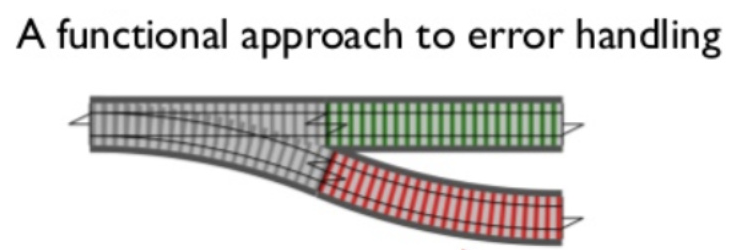

> 자바스크립트로 하는 함수형 프로그래밍에 대해서 글을 써볼까 합니다. 우연한 기회로 함수형 프로그래밍에 대한 관심을 갖게 됐고, 프론트엔드 개발을 하면서 적용했던 함수형 프로그래밍에 대해서 다뤄볼 예정입니다.

**[시작 글: 코드 스타일](/fp-in-js-1-code-style)**

**[두 번째 글: 함수 컴포지션, 커링](/fp-in-js-2-composition-currying)**

**[세 번째 글: 함수형 프로그래밍의 특징](/fp-in-js-3-about-fp)**

오늘은 펑터(Functor)에 대해서 알아보도록 하겠습니다. 함수형 프로그래밍에 생소하신 분들은 `펑터`라는 용어가 생소하실 수 있습니다. ~~함수면 함수지 `자`를 붙여서 펑터는 뭐지? 거기다가 영어 스펠링도 Function 이랑 비스무리하게 Functor 라고 쓰네? 라고 생각이 드실 수 있습니다.~~ `특정한 조건을 만족하는 객체`라고 생각하시면 됩니다.

## 상자에 값을 넣어보자

### 상자 만들기

값을 상자에 넣는 것부터 시작해보도록 합시다. 그러려면 상자부터 있어야겠죠? 상자를 만들어봅시다.

```js
class Box {

}
```

아주 간단하게 class를 이용해서 Box 라는 상자를 만들었습니다. 여기에 값을 넣어보도록 할까요?

```js
class Box {
  constructor(value) {
    this.$value = value;
  }

  static of (value) {
    return new Box(value);
  }
}

const box1 = new Box('FP'); // Box('FP');
const box2 = Box.of('FP2'); // Box('FP2');
const box3 = Box.of(Box.of('FP3')); // Box(Box('FP3'));
```

Box 클래스는 new 키워드를 이용해서 인스턴스를 만들수 있고, static 메소드 of 를 이용해서 만들수도 있습니다. 보시다시피 Box 클래스에 $value 라는 필드에 값을 할당 합니다. $value에 할당할 수 있는 객체는 특별한 타입으로 제한하지 않고 무엇이는 할당할 수 있습니다.

### of 는 왜 있을까?

그런데 왜 of 라는 static 메소드를 이용해서 인스턴스를 만들도록 했을까요? 이유는 new 를 이용해서 생성하기 귀찮아서 입니다. 무슨 소리냐면, 함수 합성을 할 때 new 키워드를 쓰기가 까다롭기 때문입니다. 그래서 new 키워드를 쓰는 대신 of 메소드를 이용하면 됩니다. 세 번째 글의 예제를 가지고 설명을 하겠습니다.

```js
pipe(
  dissoc('age'),
  rename({ work: 'job' })
)(person); // { name: 'nakta', job: 'developer' }
```

위 예제는 마지막 결과값이 `{ name: 'nakta', job: 'developer' }` 가 됩니다. 그런데 이 값을 박스에 넣고 싶다고 할 때 어떻게 할까요? 화살표 함수를 이용해서 인스턴스를 생성해야 합니다.

```js
pipe(
  dissoc('age'),
  rename({ work: 'job' }),
  (value) => new Box(value)
)(person); // Box({ name: 'nakta', job: 'developer' })
```

그런데 뭔가 깔끔한 느낌이 들지 않죠? 그래서 of 메소드를 이용하게 됩니다.

```js
pipe(
  dissoc('age'),
  rename({ work: 'job' }),
  Box.of
)(person); // Box({ name: 'nakta', job: 'developer' })
```

이렇게 new 키워드를 이용해서 생성할때 는 코드도 깔끔하지 않고 번거롭게 함수도 선언해서 사용해야 했는데 of 메소드를 이용하니 아주 간단해졌습니다. 이런 이유에서 굳이 of 라는 static 메소드를 추가한 것입니다.

## 상자에 있는 값을 바꾸고 싶다

값을 상자에 넣긴 했습니다. 그럼 상자에 넣은 것으로 끝일까요? 아니죠 우리 입맛에 맞게 값을 바꿔야죠. 예제를 보면서 같이 값을 바꿔보도록 하죠. ~예제를 생각하는게 가장 귀찮네요.~

### 상자에 있는 값 직접 접근하기

**책 찾기**

책 id를 이용해서 책 제목의 첫 글자를 대문자로 변환해서 반환하는 함수를 만들어 봅시다.

```js
const books = [
  { id: 'book1', title: 'coding with javascript' },
  { id: 'book2', title: 'speaking javaScript' },
];

// 첫 글자를 대문자로 바꿔줍니다.
const startCase = (str) => {
  return str.charAt(0).toUpperCase() + str.slice(1);
};

// 객체에서 propName에 해당하는 값을 반환합니다.
const prop = curry((propName, obj) => {
  return obj[propName];
});

const findBookById = (id, books) => {
  return books.find((book) => book.id === id);
};

const getUpperBookTitleById = (id, books) => {
  return pipe(
    Box.of, // Box(books)
    (box) => findBookById(id, box.$value),
    prop('title'),
    startCase
  )(books)
};

getUpperBookTitleById('book1', books); // "Coding with javascript"
getUpperBookTitleById('book2', books); // "Speaking javaScript"

```

완성된 코드입니다. getUpperBookTitleById 함수를 살펴보도록 하죠.

```js
const getUpperBookTitleById = (id, books) => {
  return pipe(
    Box.of, // Box(books)
    (box) => findBookById(id, box.$value),
    prop('title'),
    startCase
  )(books)
};
```

Box.of 로 books를 상자안에 넣었습니다. 상자 안에 넣은 books를 이용해야 하기 때문에 box.\$value를 이용해서 books에 접근합니다. prop 함수를 이용해서 title 값을 가져오고, 최종적으로 startCase 함수를 이용해서 첫 글자를 대문자로 바꿔줍니다.

### 상자를 유지해서 값 바꿔주기 (펑터)

근데 뭔가 좀 이상하지 않나요? 상자에 값을 넣고 다시 빼서 쓸거면 뭐하러 상자에 넣을까요? 저렇게 상자에 넣고 다시 꺼내서 쓸거면 애초에 넣을 필요가 없을텐데요. 적어도 상자에 값을 넣은 행동이 의미 있게 상자 안에 값을 유지한 상태로 바꿔보도록 하죠. 상자에 특별한 기능을 붙여 줍니다. map 이라는 메소드를 추가 하도록 하겠습니다.

```js
class Box {
  constructor(value) {
    this.$value = value;
  }

  static of (value) {
    return new Box(value);
  }

  map(fn) {
    return new Box(fn(this.$value));
  }
}
```

Box 클래스에 추가한 map 메소드는 무슨 일을 할까요? 파라미터로 함수를 넘겨주고 있습니다. 그리고 그 함수를 상자 안에 넣은 값에 적용하고 있습니다. 마지막으로 다시 Box 로 감싸서 반환해줍니다. 즉, `상자 안에 값이 있고 이 값에 함수를 적용해서 새로운 상자를 반환`합니다.

```js
const addFive = (num) => {
  return num + 5;
}

// 첫 글자를 대문자로 바꿔줍니다.
const startCase = (str) => {
  return str.charAt(0).toUpperCase() + str.slice(1);
};

Box.of(1).map(addFive); // Box(6)
Box.of(1).map(addFive).map(addFive); // Box(11)
Box.of('hello, FP').map(startCase); // Box('Hello, FP')
```

자, 이렇게 만들어보니 Box 에 값을 넣고 map 메소드를 이용하면 Box 를 유지한 채로 값을 변경할 수 있게 됐습니다. 게다가 반환 값이 Box 인스턴스이므로 반환 값에 다시 map을 이용해서 값을 변경할 수 있습니다. 사실은 값을 변경했다기 보다 함수를 이용해서 새로운 Box 인스턴스를 반환했다고 말하는게 더 정확합니다. 이전 인스턴스의 값에 변경을 가하지 않고 새로운 Box 인스턴스를 만들었으니까요.

드디어! 여러분은 이 글의 주제인 펑터를 만나게 됐습니다.

> **펑터**: 같은 타입을 반환하는 map 메소드를 구현한 객체.

정말 특별할것 없는 객체입니다. Box 는 map 메소드를 구현합니다. 이 때 map의 결과는 다시 Box 인스턴스를 반환합니다. 위 조건에 부합하기 때문에 Box는 펑터(Functor)라고 할 수 있습니다. 어때요? 간단하죠?

> **Array도 펑터였다?**
>
> map 이라는 메소드 어디서 본적 없으신가요? 자바스크립트 Array 타입에도 있는 메소드입니다. Array.prototype.map 를 이용하면 배열을 순회하면서 map으로 넘겨준 함수를 적용한 결과 배열을 다시 반환해주죠. 왜 여기서 Array에 구현된 map을 언급했을까요? 감이 잡히시나요?
> Array.prototype.map에 파라미터로 함수를 넘긴다. 그 결과는 함수를 적용한 값들의 Array다. 혹시 눈치 채셨나요? 펑터의 조건을 만족하고 있습니다. 그래서 Array도 펑터입니다. 놀랍지 않나요?? 우린 Array가 펑터라는 사실을 모르고 펑터를 사용하고 있었습니다.
>
> ```js
> [1, 4, 9, 16].map(x => x * 2); // Array [2, 8, 18, 32]
> ```

그럼 다시 돌아가서 이렇게 구현한 map을 이용해서 책찾기를 구현해볼까요?

```js
const books = [
  { id: 'book1', title: 'coding with javascript' },
  { id: 'book2', title: 'speaking javaScript' },
];

// 첫 글자를 대문자로 바꿔줍니다.
const startCase = (str) => {
  return str.charAt(0).toUpperCase() + str.slice(1);
};

// 객체에서 propName에 해당하는 값을 반환합니다.
const prop = curry((propName, obj) => {
  return obj[propName];
});

const findBookById = curry((id, books) => {
  return books.find((id) => book.id === id);
});

// 펑터에 map 메소드를 실행할 helper 함수
const map = curry((fn, functor) => {
  return functor.map(fn);
});

const getUpperBookTitleById = (id, books) => {
  return pipe(
    Box.of, // Box(books)
    map(findBookById(id)), // Box(book)
    map(prop('title')), // Box('book title');
    map(startCase) // Box('Book title');
  )(books)
};

getUpperBookTitleById('book1', books); // Box("Coding with javascript")
getUpperBookTitleById('book2', books); // Box("Speaking javaScript")

```

Box에 있는 \$value에 직접 접근하는 대신 map 메소드를 이용해서 최종적으로 원하는 책의 제목을 찾아 냈습니다. 그럼 도대체 왜 이 펑터를 쓸까요? 굳이 **값을 상자 안에 넣어서 이렇게 이용하는 진짜 목적이 뭘까요?**

## 그래서 펑터는 왜 쓰는거야? 예외처리를 위한 펑터

함수 합성을 이용해서 함수형 프로그래밍을 할 때 문제가 하나 있습니다. 바로 예외처리가 힘들다는 점인데요. 상황을 한번 살펴볼까요? 위 예제에서 books에는 book1과 book2가 있습니다. 그런데 book3를 찾으려고 하면 어떻게 될까요?

```js
getUpperBookTitleById('book1', books); // Box("Coding with javascript")
getUpperBookTitleById('book2', books); // Box("Speaking javaScript")
getUpperBookTitleById('book3', books); // Cannot read property 'title' of undefined
```

안타 깝게도 위와 같은 에러가 발생합니다. 왜일까요? findByBooId에서 book3 라는 아이디로 책을 찾을때 결과로 undefined를 반환합니다. book3에 해당하는 책이 없으니까요. 이 반환된 undefined가 prop('title')의 파라미터로 넘어가기 때문에 undefined['title'] 을 실행하게 되죠. 여기서 에러가 발생하게 됩니다.

### 노가다성 해결 책

prop 함수를 실행하다가 에러가 났으니 위 함수에서 예외처리를 해주면 될것 같습니다. obj 가 undefined 거나 null 인 경우 예외처리를 추가합니다.

```js
const prop = curry((propName, obj) => {
  return obj && obj[propName];
});
```

이렇게 하면 prop 함수에서는 더 이상 에러가 발생하지 않습니다. 다시 한번 확인해볼까요?

```js
getUpperBookTitleById('book3', books); // Cannot read property 'charAt' of undefined
```

아... 새로운 에러가 발생합니다. prop 함수는 무사히 지나 갔지만 그 다음 함수인 startCase에러 다시 에러가 발생합니다. 뭔가 본질적인 문제 해결이 필요합니다. 아니 간단하게 startCase에서도 에러 처리를 해주면 되지 그게 뭐가 문제냐 하시는 분도 계시겠지만. 함수 합성이 계속 해서 10개 20개 이어진다면 어떨까요? 이후에 나오는 모든 함수에서도 예외처리를 넣어줘야 합니다. 말도 안되는 상황이죠.

### 우아한 해결책 (Maybe)

위 문제를 해결할 우아한 방법이 있습니다. 펑터를 이용한 방법입니다. **Maybe**라는 이름의 펑터를 만들어 보겠습니다.

```js
class Maybe {
  constructor(value) {
    this.$value = value;
  }

  static of(value) {
    return new Maybe(value);
  }

  get isNothing() {
    return this.$value === null || this.$value === undefined;
  }

  map(fn) {
    return this.isNothing ? this : Maybe.of(fn(this.$value));
  }

  toString() {
    return this.isNothing ? 'Nothing' : `Just(${this.$value})`
  }
}
```

일반적으로 Maybe 펑터는 두 가지 상태를 가집니다. `Nohting`과 `Just`입니다. Nothing은 \$value가 null이거나 undefined 인 경우입니다. 그 외 값을 가진 경우는 Just입니다.

그리고, Box와 map 구현이 살짝 다른게 보이시나요? Box에서는 \$value 값에 fn을 무조건 적용했습니다. 하지만 Maybe에서는 Nothing 상태일때는 fn 함수를 적용하지 않고 Nohting 상태의 Maybe를 그대로 반환합니다. Just 상태일 때는 Box와 마찬가지로 fn 함수를 적용한 결과를 반환합니다.

toString은 구현하지 않아도 되지만 디버깅 시 현재 상태를 확인하기 쉽게 구현했습니다.

그럼 Box를 Maybe로 바꿔서 확인해보도록 하겠습니다.

```js
const getUpperBookTitleById = (id, books) => {
  return pipe(
    Maybe.of,
    map(findBookById(id)),
    map(prop('title')),
    map(startCase)
  )(books)
};

getUpperBookTitleById('book1', books); // Just("Coding with javascript")
getUpperBookTitleById('book2', books); // Just("Speaking javaScript")
getUpperBookTitleById('book3', books); // Nothing
```

Box를 Maybe로 바꿨을 뿐인데 에러없이 결과만 Nothing 상태의 Maybe가 나왔습니다. 어떻게 된걸까요? `Maybe.of(books)`는 `Just(Books)`가 됩니다. 다음 단계에서 `map(findBookById(id))`를 실행 할 때 id가 `book3`인 경우 `findBookById('book3')`의 결과가 undefined가 됩니다. 이 때 Maybe의 $value가 undefined가 되면서 상태는 `Nothing`으로 바뀌게 됩니다. 이 때부터는 `map(prop('title'))`과 `map(startCase)` 두 함수 모두 실행하지 않고 Nothing을 반환하게 됩니다. 즉, Maybe를 이용하면 $value 값이 null 또는 undefined가 되는 순간 뒤에 어이지는 함수는 모두 무시하게 됩니다. 이렇게 하면 각 함수에서 예외처리를 하지 않고도 아주 우아한 방법으로 에러처리가 가능합니다.

이런 패턴이 마치 기찻길과 비슷하다고 하여 **Railway Oriented Programming** 라고도 합니다.



위 그림에서 초록색 길은 Just, 빨간색 길은 Nothing 라고 생각하면 될 것 같습니다.

## 펑터 값 꺼내기

지금까지 처리한 결과는 모두 펑터 형태였습니다. Nothing 또는 Just 형태였죠. 우리가 상자 안에 값을 넣어서 처리했기 때문에 어찌됐건 마지막 단계에서는 값을 꺼내서 사용해야 합니다. 물론 \$value에 접근해서 값을 꺼내도 되지만 Nothing 상태인 경우 default 값을 반환할 수 있는 도우미 함수를 만들어 보도록 하겠습니다.

```js
const getOrElse = curry((defaultValue, fn, maybe) => {
  return maybe.isNothing ? defaultValue : fn(maybe.$value);
});
```

getOrElse 함수는 세 개의 파라미터를 받아서 처리합니다. 첫 번째 값은 maybe가 Nothing일 때 반환 할 기본값. 두 번째는 Just일때 최종적으로 \$value에 적용할 함수. 마지막은 Maybe 인스턴스입니다.

```js
const getUpperBookTitleById = (id, books) => {
  return pipe(
    Maybe.of,
    map(findBookById(id)),
    map(prop('title')),
    getOrElse(`${id} Not Found`, startCase)
  )(books)
};

getUpperBookTitleById('book1', books); // "Coding with javascript"
getUpperBookTitleById('book2', books); // "Speaking javaScript"
getUpperBookTitleById('book3', books); // "book3 Not Found"
```

getOrElse를 이용해서 최종적으로 값을 꺼낸 구현입니다. 마지막 map(startCase) 를 getOrElse 두 번째 인자로 옮겨서 마지막에 startCase를 적용한 값을 반환하도록 처리했습니다. 정말 멋지지 않나요? 위에 제가 구현한 getOrElse 처럼 최종적으로 함수를 적용하지 않고 현재 값을 추출하고 싶다면 구현을 살짝 바꾸기만 하면 됩니다.

```js
const getOrElse = curry((defaultValue, maybe) => {
  return maybe.isNothing ? defualtValue : maybe.$value;
});

const getUpperBookTitleById = (id, books) => {
  return pipe(
    Maybe.of,
    map(findBookById(id)),
    map(prop('title')),
    map(startCase),
    getOrElse(`${id} Not Found`)
  )(books)
};
```

위 처럼 getOrElse를 구현해서 getOrElse 이전에 map(startCase)를 실행해주면 결과는 같습니다.

## 종합

오늘은 펑터에 대해서 같이 살펴봤습니다. **펑터는 같은 타입을 반환하는 map 메소드를 구현한 객체**입니다.

**함수 합성에서 에러가 발생**하는 경우 우아한 해결책으로 펑터를 이용했습니다. 이 펑터의 이름은 **Maybe** 입니다.

Maybe는 두 가지 상태를 갖습니다. Nothing과 Just 입니다. Nothing이 되는 순간 이후에 나타나는 map 메소드는 모두 무시 합니다. 이런 것을 **ROP:Railway Oriented Programming** 이라고도 합니다.

펑터에 대해서 최대한 쉽게 설명한다고 했는데 이해가 잘 되셨는지 모르겠습니다. 혹시나 궁금한점 있으시거나 잘못 된 부분 있다면 댓글로 달아주세요. 할 수 있는 한 성심껏 댓글 달겠습니다.

## 다음은?

Maybe 펑터에 이어 Either 펑터에 대해서 알아보도록 하겠습니다.

## 참조

- https://developer.mozilla.org/ko/docs/Web/JavaScript/Reference/Global_Objects/Array/map
- https://forums.fast.ai/t/rop-railway-oriented-programming-in-swift/44428
