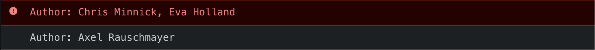

> 자바스크립트로 하는 함수형 프로그래밍에 대해서 글을 써볼까 합니다. 우연한 기회로 함수형 프로그래밍에 대한 관심을 갖게 됐고, 프론트엔드 개발을 하면서 적용했던 함수형 프로그래밍에 대해서 다뤄볼 예정입니다.

**[시작 글: 코드 스타일](/fp-in-js-1-code-style)**

**[두 번째 글: 함수 컴포지션, 커링](/fp-in-js-2-composition-currying)**

**[세 번째 글: 함수형 프로그래밍의 특징](/fp-in-js-3-about-fp)**

**[네 번째 글: 펑터, Maybe](/fp-in-js-4-functor-maybe)**

지난 글에서 Maybe라는 펑터에 대해서 알아봤습니다. 오늘은 지난 글에 이어서 Either라는 펑터에 대해서 알아보겠습니다. Maybe를 쓸 때 약간의 부족한 부분이 있는데 이 부분을 채워줄 수 있는 펑터입니다.

## Maybe: 멋있지만 살짝 모자란 친구

이전 글에서 Maybe라는 멋진 펑터를 알아봤습니다. 함수 컴포지션에서 에러 처리시에 아주 우아하게 처리할 수 있게 도와주는 펑터였습니다. map 을 이용해서 함수 컴포지션을 할 때 Nothing이 되는 순간 그 뒤로 실행해야 할 map을 모두 무시할 수 있었기 때문이죠. 그리고 마지막엔 Maybe가 들고있는 값을 뽑아내거나 Nothing인 경우 기본값을 지정해줄수 있었습니다.

### Maybe의 한계

자 그럼 마지막에 기본값을 리턴해 주는게 아니라 특별한 처리를 하고 싶은 경우는 어떻게 해야 할까요? books에서 아이디로 책을 찾아서 저자명을 로그로 찍어주도록 해봅시다. 여기서 저자명이 Axel인 경우는 console.log로 Axel이 아닌 경우 console.error로 에러 로그를 찍어주도록 합니다.

책 데이터는 아래와 같습니다.

```js
const books = [
  { id: 'book1', title: 'coding with javascript', author: 'Chris Minnick, Eva Holland' },
  { id: 'book2', title: 'speaking javaScript', author: 'Axel Rauschmayer' },
];
```

그리고, 책을 찾는 함수입니다. 책 아이디와 책 목록을 받아서 책을 찾아 반환해줍니다.

```js
const findBookById = curry((id, books) => {
  return books.find((book) => book.id === id);
});
```

이번엔 책의 저자가 Axel인 경우 Just를 반환해 주고 그렇지 않은 경우 Nothing을 반환하도록 하는 함수를 만들어 줍니다. indexOf를 이용해서 Axel이 포함된 경우 Maybe에 book을 넘겨줍니다. 그렇지 않은 경우 Nothing을 반환하기 위해 null을 넘깁니다.

```js
const validateBookAuthor = (book) => {
  return book.author.indexOf('Axel') > -1 ? Maybe.of(book) : Maybe.of(null);
}
```

이제 함수를 조합해서 책의 저자명을 로그로 찍어주는 작업을 시작하도록 합시다. `findBookById`를 이용해서 책을 찾아주도록 합니다. 그 다음 `validateBookAuth`로 저자가 Axel가 아니라면 `Nothing`을 반환해주도록 합니다.

```js
const logBookAuthor = (bookId, books) => {
  return pipe(
    findBookById(bookId),
    validateBookAuthor
  )(books)
};


logBookAuthor('book1', books); // Nothing
logBookAuthor('book2', books); // Just({ id: 'book2', title: 'speaking javaScript', author: 'Axel Rauschmayer' })
```

다음으로 저자명을 로그로 찍어줘야 하는데 `Just`인 경우만 자자명이 Axel이므로 상태를 확인해주도록 합니다. isNothing 으로 상태를 확인해서 따로 처리해주면 될것 같습니다.

```js
const logBookAuthor = (bookId, books) => {
  return pipe(
    findBookById(bookId),
    validateBookAuthor,
    (maybeAxelBook) => {
      if (maybeAxelBook.isNothing) {
        // console.error로 책 저자 로그
      } else {
        // console.log로 책 저자 로그
      }
    }
  )(books)
};
```

그 전에 상태로 분기처리해서 로그 찍어주는 부분을 함수로 추출해볼까요?

```js
const logByMaybeStatus = (maybeAxelBook) => {
  if (maybeAxelBook.isNothing) {
    // console.error로 책 저자 로그
  } else {
    // console.log로 책 저자 로그
  }
}

const logBookAuthor = (bookId, books) => {
  return pipe(
    findBookById(bookId),
    validateBookAuthor,
    logByMaybeStatus
  )(books)
};
```

이제 각 책의 저자 명을 로그로 찍어볼까요? `Just`인 경우 maybe에서 책을 꺼내서 저자 명을 로그로 찍어줍니다.

```js
const logByMaybeStatus = (maybeAxelBook) => {
  if (maybeAxelBook.isNothing) {
    // console.error로 책 저자 로그
  } else {
	console.log(maybeAxelBook.$value.author);
  }
}
```

다음으로 `Nothing`인 경우는 에러 로그를 이용해서 저자를 찍어줍니다. 그런데 문제가 있습니다. `Nothing`인 경우 \$value 값이 undefined거나 null입니다. 즉, Axel이 아닌 책의 저자를 로그로 찍어주고 싶어도 정보가 없습니다. 어쩌면 좋을까요?

## Either: Maybe 보다 한수 위

Maybe는 에러 상황에 기본 값만을 지정하는게 최선의 방법입니다. 만약 Nothing 상태 일때도 참조할만한 값을 가지고 있다면 위 상황이 해결되지 않을까요? 그러면 Nothing일 때도 Just와 마찬가지로 값을 뽑아서 에러 로그로 찍어주기만 하면 될것 같습니다.

드디어 오늘의 주인공 Either가 나올 타이밍이 됐습니다. **에러처리시에 참조할 값을 들고있는 펑터가 바로 Either** 입니다.

### Either 구현

Either 구현부터 먼저 보도록 하죠. 총 세 개의 클래스를 구현합니다. Either, Right, Left입니다.

```js
class Either {
  constructor(value){
    this.$value = value;
  }

  static right(value) {
    return new Right(value)
  }

  static left(value) {
    return new Left(value);
  }
}

class Right extends Either {
  get isRight() {
    return true;
  }

  get isLeft() {
    return false
  }

  map(fn) {
    return new Right(fn(this.$value));
  }
}

class Left extends Either {
  get isRight() {
    return false;
  }

  get isLeft() {
    return true;
  }

  map(fn) {
    return this;
  }
}
```

Maybe의 상태가 Just와 Nothing 두 가지인 것처럼 Either의 상태는 Left와 Right 두 가지 입니다. Left인 경우가 Nothing에 매칭되고 Right인 경우가 Just에 매칭 된다고 생각하면 됩니다. Either 클래스부터 살펴보도록 할까요? 생성자로 받은 값을 \$value에 저장합니다. 그리고 static 메소드로 right와 left를 가집니다. 각 메소드를 이용해서 Right 또는 Left 인스턴스를 만들게 됩니다.

```js
class Either {
  constructor(value){
    this.$value = value;
  }

  static right(value) {
    return new Right(value)
  }

  static left(value) {
    return new Left(value);
  }
}
```

다음은 Right 클래스를 살펴보도록 합시다. Either 클래스를 상속받고 있습니다. 그리고 상태를 확인할 수 있는 isRight와 isLeft가 있습니다. Right 클래스이기 때문에 isRight가 true이고 isLeft가 false를 반환하도록 했습니다. 마지막으로 map 메소드를 구현해서 파라미터로 받은 함수를 값에 적용하고 다시 Right 인스턴스를 반환하고 있습니다. 즉, 펑터로 만들었습니다.

```js
class Right extends Either {
  get isRight() {
    return true;
  }

  get isLeft() {
    return false
  }

  map(fn) {
    return new Right(fn(this.$value));
  }
}
```

다음은 Left 클래스를 살펴보도록 합시다. Right와 마찬가지로 Either 클래스를 상속 받습니다. 그리고 상태 값을 확인할 수 있는 isRight와 isLeft를 각각 false와 true를 반환하도록 했습니다. 마지막으로 map 메소드를 구현해서 아무것도 처리하지 않고 Left 자신을 그대로 반환하도록 했습니다. 이 map 구현도 펑터라고 할 수 있겠죠?

```js
class Left extends Either {
  get isRight() {
    return false;
  }

  get isLeft() {
    return true;
  }

  map(fn) {
    return this;
  }
}
```

뭔가 새로운게 나온것 같지만 Maybe와 크게 다르지 않습니다. Right만 map으로 넘긴 함수를 실행해서 다시 반환합니다. Left인 경우는 map으로 넘긴 함수는 실행하지 않습니다. Maybe와 다른 점은 Left인 경우도 값을 가지고 있다는 점만 다릅니다.

```js
const concat = curry((str1, str2) => {
  return `${str1}${str2}`
})

Either.right('Star').map(concat('Super')); // Right('SuperStart')
Either.left('Star').map(concat('Super')); // Left('Star')

Either.right({name: 'Nakta', job: 'Developer'}).map(prop('name')); // 'Nakta'
Either.left({name: 'Nakta', job: 'Developer'}).map(prop('name')); // {name: 'Nakta', job: 'Developer'}
```

### Either로 해결해보자

Maybe로 해결하기 번거로웠던 부분을 다시 살펴볼까요? Nothing 일때 책 정보가 없어서 저자명을 찍어주기가 힘들었습니다.

```js
const validateBookAuthor = (book) => {
  return book.author.indexOf('Axel') > -1 ? Maybe.of(book) : Maybe.of(null);
}

const logByMaybeStatus = (maybeAxelBook) => {
  if (maybeAxelBook.isNothing) {
    // console.error로 책 저자 로그
  } else {
    // console.log로 책 저자 로그
  }
}

const logBookAuthor = (bookId, books) => {
  return pipe(
    findBookById(bookId),
    validateBookAuthor,
    logByMaybeStatus
  )(books)
};
```

Maybe로 구현한 부분을 Either로 바꿔서 구현해보도록 하겠습니다.
우선 validateBookAuthor 반환 값을 Maybe가 아닌 Either로 반환하도록 수정합니다.

```js
const validateBookAuthor = (book) => {
  return book.author.indexOf('Axel') === -1
    ? Either.left(book)
    : Either.right(book);
}
```

그리고 상태에 따라 로그를 찍어주는 logByMaybeStatus 함수를 수정합니다. 함수명도 적절히 Either가 들어가도록 수정해 줍니다. left 상태인 경우 console.error, right 상태인 경우 console.log로 처리하도록 수정합니다.

```js
const logByEitherStatus = (eitherBook) => {
  return eitherBook.isLeft
    ? console.error(`Author: ${eitherBook.$value.author}`)
    : console.log(`Author: ${eitherBook.$value.author}`)
}

const logBookAuthor = (bookId, books) => {
  return pipe(
    findBookById(bookId),
    validateBookAuthor,
    logByEitherStatus
  )(books)
};


logBookAuthor('book1', books);
logBookAuthor('book2', books);
```



어떤가요? Maybe를 이용했을때 처리하기 힘들었던 부분을 Either라는 펑터를 이용해서 해결할 수 있게 됐습니다.

### 한 단계 더

Maybe를 이용했을 때 getOrElse 구현했던걸 기억하시나요? 이와 마찬가지로 Either를 사용할 때도 마지막에 도와줄 함수를 하나 만들겠습니다. Left일때와 Right일때 실행할 함수 두 개와 마지막으로 Either 인스턴스를 받는 함수입니다.

```js
const either = curry((l, r, e) => {
  return e.isLeft ? l(e.$value) : r(e.$value);
});
```

either 함수를 이용해서 저자명 출력하는 상황을 해결해 보도록 할까요?

```js
const logBookAuthor = (book) => {
  console.log(`Author: ${book.author}`)
};

const logErrorBookAuthor = (book) => {
  console.error(`Author: ${book.author}`);
};

const validateBookAuthor = (book) => {
  return book.author.indexOf('Axel') === -1
    ? Either.left(book)
    : Either.right(book);
}

const logBookAuthor = (bookId, books) => {
  return pipe(
    findBookById(bookId),
    validateBookAuthor,
    either(logErrorBookAuthor, logBookAuthor)
  )(books)
};
```

어떤가요? **left와 right 각 상태에 따라서 어떻게 처리할지가 함수명으로 더 잘보이는 느낌**이 들지 않나요? 이렇게 코드를 작성하면 각 상태별로 어떻게 처리하는지 쉽게 읽을 수 있게 돼서 코드가 무엇을 하는지에 더 집중해서 읽을 수 있게 됩니다.

## 정리

오늘은 새로운 펑터 Either를 알아봤습니다. Either는 Maybe 펑터가 Nothing 일 때 아무값도 갖고 있지 않은 단점을 커버해 줄 수 있는 펑터입니다.

**Either 상태**

- Left: 에러 처리에 필요한 값을 가짐
- Right: Maybe의 Just와 마찬가지로 정상적인 처리의 값을 가짐

긴 글 읽어주셔서 감사합니다.

## 다음은?

다음은 **IO, Future**에 대해서 살펴보도록 하겠습니다.
