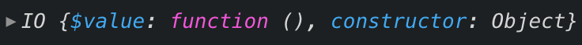

> 자바스크립트로 하는 함수형 프로그래밍에 대해서 글을 써볼까 합니다. 우연한 기회로 함수형 프로그래밍에 대한 관심을 갖게 됐고, 프론트엔드 개발을 하면서 적용했던 함수형 프로그래밍에 대해서 다뤄볼 예정입니다.

**[시작 글: 코드 스타일](/fp-in-js-1-code-style)**

**[두 번째 글: 함수 컴포지션, 커링](/fp-in-js-2-composition-currying)**

**[세 번째 글: 함수형 프로그래밍의 특징](/fp-in-js-3-about-fp)**

**[네 번째 글: 펑터, Maybe](/fp-in-js-4-functor-maybe)**

**[다섯 번째 글: Either](/fp-in-js-5-either)**

함수형 프로그래밍의 특징 중 하나가 바로 참조 투명성 입니다. 참조투명성은 함수를 실행한 결과가 같은 인풋이라면 언제나 같은 아웃풋을 보장하는것을 말합니다. 함수 내에서 외부 변수를 참조하거나 외부 변수의 값을 바꾸는 작업을 하지 않기 때문에 가능합니다. 그런데 개발을 하다 보면 외부에 있는 데이터에 접근해야 하는 경우가 있습니다. 이런 경우 함수형 프로그래밍에서는 어떤 방식으로 처리하는지 살펴보도록 하겠습니다.

## 참조 투명성을 깨는 행동들

그렇다면 어떤 동작을 할 때 참조 투명성이 깨질까요? 함수 외부에 있는 변수를 참조하기 시작하면 참조투명성을 보장할 수 없습니다. 외부에 있는 변수는 언제 어디서 바뀔지 모르는 값이니까요. 아래 행동들이 참조 투명성을 보장하지 못하는 것들입니다.

- http 요청
- 화면 또는 로그상 출력
- DOM 접근
- 등등...

위와 같이 외부 요소에 대한 I/O와 관련된 행동들 입니다.

localStorage에서 값을 꺼내오는 행동도 참조 투명성을 깨는 행동입니다. localStorage의 값이 외부에서 충분히 바뀔 수 있는 가능성이 있기 때문이죠.

```js
const getStorage = (key) => {
  return localStorage[key];
}
```

localStorage에 tutorial을 키로 ready를 저장합니다. 그리고 `getStorage('tutorial')`을 하면 당연히 `ready`가 반환됩니다. 바로 다음 complete로 변경하고 이전과 똑같은 파라미터로 `getStorage('tutorial')`를 실행하면 이번엔 `complete`이 반환됩니다. 두 번다 같은 파라미터인 'tutorial'을 전달했지만 반환값을 외부 localStorage를 참조하기 때문에 매번 달라질 수 있습니다.

```js
const getStorage = (key) => {
  return localStorage[key];
}

const setStorage = (key, val) => {
  localStorage[key] = val;
}

setStorage('tutorial', 'ready');

console.log(getStorage('tutorial')); // ready

setStorage('tutorial', 'complete');

console.log(getStorage('tutorial')); // complte
```

## IO: I/O 해결사

이런 문제를 해결하려면 어떻게 하면 좋을까요? **IO**를 이용해서 참조 투명성을 깰 수 있는 부분을 상자에 넣어서 관리할 수 있습니다. 무슨소린지 IO 구현분터 먼저 살펴보도록 합시다.

```js
class IO {
  static of(value) {
	return new IO(() => value);
  }

  constructor(fn) {
    this.$value = fn;
  }

  map(fn) {
	return new IO(pipe(this.$value, fn));
  }
}
```

전에 살펴봤던 Maybe, Either와 마찬가지로 같은 타입을 반환하는 map을 구현했습니다. IO도 펑터라고 불러도 되겠군요. 그런데 Maybe, Either와 약간 차이가 있습니다.

Maybe에서 구현했던 of 메소드는 value를 받은 그대로 Maybe 생성자로 넘겼습니다.

```js
static of(value) {
  return new Maybe(value);
}
```

반면 IO는 value를 리턴해주는 함수를 IO 생성자로 넘겨줍니다.

```js
static of(value) {
  return IO(() => value);
}
```

그리고 생성자를 살펴볼까요? Maybe에서 생성자는 \$value에 값을 그대로 저장했죠.

```js
constructor(value) {
  this.$value = value;
}
```

IO는 어떤가요? IO는 생성자에 값을 받는게 아니라 함수를 받습니다. fn이 함수만 받을수 있도록 제한한것은 아니지만 `fn`이라는 이름에서 함수라는것을 유추할수 있스니다. 그리고 of 메소드에서 함수를 만들어서 생성자로 넘겨줬었죠.

```js
constructor(fn) {
  this.$value = fn;
}
```

다음은 map 메소드를 살펴보겠습니다. Maybe는 함수를 받아서 Nothing 상태일때는 아무처리도 하지 않았고, Just 상태일때는 \$value에 함수를 실행해서 다시 Maybe 감싸서 리턴했습니다.

```js
map(fn) {
  return this.isNothing ? this : Maybe.of(fn(this.$value));
}
```

IO의 map은 조금 다릅니다. $value 값 자체가 함수입니다. pipe를 이용해서 기존에 들고있던 $value 함수와 새롭게 받은 fn 함수를 함성시켰습니다. 즉, `함수를 실행하지 않고 기존 함수와 새로 받은 함수를 차례대로 실행할 수 있는 새로운 함수를 만들어서 다시 IO에 넣은 형태`입니다.

```js
map(fn) {
  return new IO(pipe(this.$value, fn));
}
```

### localStorage 예제

이제 IO 펑터를 어떻게 사용하는지 확인해봅시다

#### IO로 localStroage 감싸기

IO를 이용해서 외부 참조인 localStorage에서 값을 가져오는 부분을 감싸줍니다. 적절히 이름도 IO를 붙여서 무엇을 반환하는지 이름으로 알 수 있도록 해줍니다.

```js
const getStorageIO = key => {
  return new IO(() => localStorage[key]);
};
```

이제 이걸 이용해서 이전 코드를 살펴볼까요?

```js
setStorage('tutorial', 'ready');

console.log(getStorageIO('tutorial'));
```

`setStorage('tutorial', 'ready')` 실행 한 후 `getStorageIO('tutorial')`를 하면 이전에 값이 반환된것과 다르게 \$value에 함수를 가진 IO 인스턴스를 반환합니다.



하지만 우리는 코드를 보고 적어도 ready가 반환되겠구나 생각 할 수 있죠. 앞으로는 저런 부분이 예상 가능한 상황이라면 `IO('ready')` 와 같이 예상 할 수 있는 값을 넣어서 표현하도록 하겠습니다. 즉, 아래처럼 표현하겠습니다.

```js
setStorage('tutorial', 'ready');

console.log(getStorageIO('tutorial')); // IO('ready')
```

#### IO 펑터 값 변경

자 그럼 IO 도 펑터였으니 저 값을 가지고 몇가지 함수를 더 붙여보도록 하겠습니다.

튜토리얼 상태에 따라 튜토리얼 할 단계를 반환하는 함수를 하나 만들어서 map 으로 연결해줍니다. 그리고 마지막에 console.log로 로그를 남겨줍니다.

```js
const getTutorialSteps = (status) => {
  return status === 'ready'
    ? [ {step: 1, title: 'First Tutorial'}, {step: 2, title: 'Second Tutorial'} ]
  	: [];
}

getStorageIO('tutorial')
  .map(getTutorialSteps);
```

위 코드를 실행하면 예상과 값이 반환되지 않습니다. 왜 그럴까요? 앞에서 설명했다시피 IO는 \$value에 값이 아닌 함수를 저장합니다. 그리고 map을 이용해서 이 함수를 합성해서 실행할 수 있는 함수를 다시 저장합니다. 즉, `모든 단계가 실행된것이 아니라 함수로 연결만 된 상태`라는 겁니다.

IO가 들고있는 값을 정확히 표현해보겠습니다.

**getStorageIO('tutorial')**

```js
IO(() => localStorage[key])
```

**.map(getTutorialSteps)**

```js
IO(pipe(
  () => localStorage[key],
  getTutorialSteps
))
```

어떠신가요? 조금더 이해하기 쉬운가요? IO는 실행 결과가 아닌 함수를 갖고있기 때문에 아직 실행전이라고 생각하면 됩니다.

#### IO 실행하기

이렇게 쭉 쌓아온 함수를 실행하게 해줄 `runIO` 메소드를 IO에 추가하겠습니다.

```js
class IO {
  static of(value) {
    return new IO(() => value);
  }

  constructor(fn) {
    this.$value = fn;
  }

  map(fn) {
    return new IO( pipe( this.$value, fn ) );
  }

  runIO() {
    return this.$value();
  }
}
```

특별한것은 없습니다. \$value를 그대로 실행만 해주는 메소드입니다. 이제 이 runIO를 이용해서 IO를 진짜 실행해줍니다.

```js
getStorageIO('tutorial')
  .map(getTutorialSteps)
  .runIO();

// [{"step":1,"title":"First Tutorial"},{"step":2,"title":"Second Tutorial"}]
```

runIO를 실행해서 그동안 쌓아둔 함수를 한번에 쭉~ 실행합니다.

이렇게 사이드 이펙트를 낼 수 있는 상황에서 IO를 쓰면 순수 함수 영역과 순수하지 않은 함수 영역을 나눠서 함수 컴포지션이 가능해집니다.

```js
// 순수하지 않은 함수
const getStorageIO = key => {
  return new IO(() => localStorage[key]);
};

// 순수 함수
const getTutorialSteps = (status) => {
  return status === 'ready'
    ? [ {step: 1, title: 'First Tutorial'}, {step: 2, title: 'Second Tutorial'} ]
  	: [];
}

// 순수하지 않은 영역과 순수한 영역의 컴포지션
getStorageIO('tutorial')
  .map(getTutorialSteps)
  .runIO();
```

결과적으로 참조 투명성을 보장할수 있게 되므로 함수형 프로그래밍의 특징에도 맞아 떨어지게 됩니다.

## Future: 비동기 I/O 해결사

앞에서 살펴본 IO 펑터와 많이 유사하지만 비동기 동작에 대해서 IO와 같은 방식으로 처리할 수 있는 펑터가 Future입니다. Promise를 이용해서 비동기 통신이 가능하지만 Proimse 방식은 바로 요청이 된다는 점과 취소가 쉽지 않다는 특징이 있습니다. Future는 IO와 마찬가지로 필요할때 요청으로 지연실행이 가능하기 때문에 동작을 한번에 실행한다는 특징이 있습니다.

### Fluture를 이용한 Future

Future라는 이름은 [Fluture](https://github.com/fluture-js/Fluture) 라는 Promise 대체 라이브러리에서 사용하는 용어 입니다.

> Fluture offers a control structure similar to Promises, Tasks, Deferreds, and what-have-you. Let's call them `Futures`.

Future는 이 Fluture 라이브러리를 이용해서 설명하도록 하겠습니다.

Fluture와 비슷하게 비동기 I/O를 처리할 수 있는 다른 라이브러리 중 [Folktale](https://folktale.origamitower.com/)의 [task](https://folktale.origamitower.com/api/v2.0.0/en/folktale.concurrency.task.html)가 있습니다. Folktale과 Fluture 모두 함수형 프로그래밍에서 비동기 처리를 위한 라이브러리이므로 본인이 더 편한 라이브러리를 사용해도 무방합니다.

### Ramda

그리고 한 가지 더 curry, map 등 보조 함수는 [Ramda](https://ramdajs.com/)를 이용하도록 하겠습니다. 왜 lodash가 아닐까요?

결론부터 말씀드리면 lodash는 함수형 프로그래밍에 적합하지 않습니다. 우리는 이전 글부터 지금까지 펑터를 이용해서 함수 컴포지션을 해왔습니다. 각 펑터는 map을 구현했기 때문에 우리가 직접 구현한 map 함수를 이용해서 함수 컴포지션이 가능했었죠.

```js
const map = curry((fn, functor) => {
  return functor.map(fn);
});

const add = curry((num, value) => {
  return value + num;
});

pipe(
  Maybe.of,
  map(add(2))
  log('result')
)(42); // result Maybe(44)
```

Maybe 펑터를 이용해서 42라는 값을 Maybe에 넣었습니다. map 함수를 이용해서 add(2)라는 함수를 넘겨서 Maybe 안의 값이 44를 가지고 있도록 했죠. 결과적으로 Maybe(44)를 갖게 됩니다. 우리가 의도했던데로죠.

그럼, Ramda와 Lodash 각 각을 이용했을때 어떻게 되는지 살펴보도록 할까요?

**Ramda**

우선 기본적으로 Ramda에서 제공하는 함수는 모두 커링된상태입니다. 얼마든지 함수 조합에 바로 사용할 수 있죠.

```js
import add from 'ramda/es/add';
import curry from 'ramda/es/curry';
import map from 'ramda/es/map';
import pipe from 'ramda/es/pipe';


const log = curry((label, value) => {
  console.log(label, value);
});

pipe(
  Maybe.of,
  ramdaMap(add(2)),
  log('Ramda map + 2: ')
)(42); // Ramda map + 2: Just(44)
```

최종 결과는 우리가 원했던데로 Maybe안에 값이 있는 형태입니다. 값이 있기 때문에 Just(44)를 반환해줍니다.

**Lodash**

Lodash도 모두 커링된 상태로 함수를 제공합니다. Ramda와 마찬가지로 각종 함수를 제공해주죠. 그럼 최종 결과를 살펴볼까요?

```js
import add from 'lodash/fp/add';
import curry from 'lodash/fp/curry';
import map from 'lodash/fp/map';
import pipe from 'lodash/fp/pipe';

const log = curry((label, value) => {
  console.log(label, value);
});

pipe(
  Maybe.of,
  map(add(2)),
  log('Lodash map + 2: ')
)(42) // Lodash map + 2: [44]
```

음... `[44]`라니... 내가 기껏 감싼 Maybe가 어디 간거지? 네 그렇습니다. `이게 제가 Lodash를 쓰지 않는 이유입니다. 펑터의 map 메소드를 지원해주지 않습니다.`

자 이제 앞으로는 Fluture와 Ramda를 이용해서 에제를 살펴보도록 하겠습니다. 기회가 된다면 Ramda에 대해서 글을 한번 써보도록 하겠습니다.

### Future 사용법

기본 적인 사용법으로 Future를 이용해서 Future 인스턴스를 만들어 줍니다.

```js
import { Future } from 'fluture/index';

Future((reject, resolve) => {
  const t = setTimeout(resolve, 100, 42);
  return () => clearTimeout(t);
})
```

Future의 파라미터로 함수를 넘겨줘야 합니다. 이 함수는 reject와 resolve라는 함수를 파라미터로 받는다. reject를 이용해서 비동기 동작의 실패와 같은 동작을 할 수 있습니다. 그리고 resolve를 이용해서 비동기 동작의 성공과 같은 동작을 할 수 있습니다.

```js
const t = setTimeout(resolve, 100, 42);
```

비동기 동작을 재현하기 위해서 setTimet으로 100ms 이후 resolve를 실행합니다. resolve를 싱행할때 파라미터로 42를 넘겨줍니다.

그리고 마지막에 함수를 다시 반환했는데 이 함수는 Future 작업을 취소 할 때 실행될 함수입니다.

```js
return () => clearTimeout(t);
```

위 동작을 100ms이 지나기 전에 취소하면 setTimeout으로 실행 예정이었던 resolve를 실행하지 않도록 처리합니다.

### Future 실행하기

Future도 I/O를 처리하기 위한 펑터이기 때문에 IO의 runIO와 마찬가지로 실행하기 위해 따로 실행해줘야 하는 fork 함수가 있습니다.

```js
import { fork, Future } from 'fluture/index';
import curry from "ramda/es/curry";

const log = curry((label, val) => {
  console.log(label, val);
})

fork(log('rejection'))(log('resolution'))(Future((reject, resolve) => {
  const t = setTimeout(resolve, 100, 42);
  return () => clearTimeout(t);
}));
```

fork의 첫 번째와 두 번째 파라미터는 각 각 실패와 성공에 대한 콜백 함수입니다. 마지막 세 번째 파라미터는 Future 인스턴스를 넘겨줍니다.

위 예제는 실패할 일이 없기 때문에 100ms 이후 `resolution 42` 라는 로그가 찍힙니다.

### Future 취소하기

fork의 반환 값은 함수를 반환하는데 이 함수를 실행하면 실행했던 future를 취소할 수 있습니다.

```js
const cancel = fork(log('rejection'))(log('resolution'))(Future((reject, resolve) => {
  const t = setTimeout(resolve, 100, 42);
  return () => clearTimeout(t);
}));

cancel();
```

이렇게 하면 작업이 취소되면서 아무런 로그도 남지 않게 됩니다.

### 복잡한 fork 간단하게 만들기

fork의 경우 한 번에 하나의 파라미터만 받게 돼있기 때문에 조금 복잡해 보입니다.

```js
const future = Future((reject, resolve) => {
  const t = setTimeout(resolve, 100, 42);
  return () => clearTimeout(t);
});

fork(log('rejection'))(log('resolution'))(future);
```

파라미터 세 개를 각 각 나눠서 하나 씩 호출해야 하는 상황이죠.

한 번에 쓰기 위해서 우리가 직접 만들면 될 것 같습니다.

```js
import { fork as flutureFork } from "fluture/index";

const fork = curry((reject, resolve, future) => {
  return flutureFork(reject)(resolve)(future);
});

fork(log('rejection'), log('resolution'), future);
```

아까보다 조금 더 보기 좋아진것 같습니다. 앞으로 이 fork 함수를 이용하도록 하겠습니다.

### TODO 가져오기 예제

간단한 예제를 한 번 살펴보겠습니다. https://jsonplaceholder.typicode.com/라는 사이트에서 제공하는 TODO API를 이용합니다.

```js
https://jsonplaceholder.typicode.com/todos/1
```

```json
{
  "userId": 1,
  "id": 1,
  "title": "delectus aut autem",
  "completed": false
}
```

위와 같이 주소 마지막에 TODO ID를 숫자 형태로 넘기면 그에 해당하는 응답을 내려 줍니다. GET 방식으로 요청하기 때문에 위 주소를 그대로 브라우저에서 입력해서 이동하면 위 응답 결과를 확인할 수 있습니다.

**예제 요구 사항**

1. TODO ID는 1 ~ 200 사이 숫자여야 한다.
2. 받아온 TODO의 제목을 대문자로 바꾸고 완료 여부와 함께 로그로 남긴다.

##### TODO: Id 유효성 체크

우선 TODO ID가 유효한 ID인지 체크하는 함수부터 만들어 볼까요?

```js
const validateId = id => {
  return typeof id !== "number"
    ? Either.Left(`TODO ID가 숫자가 아닙니다: ${id}`)
    : id < 1 || id > 200
    ? Either.Left(`TODO ID가 유효 범위에 있지 않습니다: ${id}`)
    : Either.Right(id);
};

validateId(1); // Right(1)
validateId("1") // Left("TODO ID가 숫자가 아닙니다: 1")
validateId(300) // Left("TODO ID가 유효 범위에 있지 않습니다: 300")
```

왜 유효하지 않은지 알려주기 위해 Either를 이용해서 유효하지 않은 이유를 Left에 남겼습니다. 유효한 경우는 Right 넣어서 반환해줍니다.

validateId 함수가 Either를 반환하기 때문에 either 헬퍼 함수를 이용해서 분기처리를 해줍니다.

```js
const either = curry((l, r, e) => {
  return e.isLeft ? l(e.value) : r(e.value);
});

either(
  log('유효하지 않은 TODO ID'),
  () => {}, // 아이디가 유효할때 API 요청해야 한다.
  validateId(1)
)
```

##### TODO: ID로 TODO 요청

이제 유효한 ID를 가지고 TODO를 요청해봅시다. id를 받아서 TODO 요청 Future 인스턴스를 반환하는 함수를 만듭니다.

```js
const fetchTodo = id => {
  return Future((reject, resolve) => {
    fetch(`https://jsonplaceholder.typicode.com/todos/${id}`)
    .then(response => response.json())
    .then(resolve)
    .catch(reject);
    return () => console.log('취소 콜백');
  });
};
```

##### TODO: TODO에서 title과 complted 가져오기

전 단계에서 만든 fetchTodo는 future를 반환하기 때문에 map을 이용해서 받아온 결과를 변경할 수 있습니다. TODO에서 title과 complted를 뽑아오는 함수를 만듭시다.

```js
const getTitleAndCompleted = pipe(
  pick(['title', 'completed']), // {title: 'abc', completed: false}
  evolve({title: toUpper}) // {title: 'ABC', completed: false}
)
```

위에서 쓰인 pick과 evolve는 Ramda 에서 제공하는 함수입니다. pick 함수는 오브젝트에서 특정 필드만 뽑아서 새로운 오브젝트를 만듭니다. evolve는 두 번째 파라미터로 받는 오브젝트에 있는 필드에 대해서 함수를 실행한 결과를 다시 할당합니다.

`evolve({title: toUpper})` 이 함수를 이용해서 title 필드를 모두 대문자로 쉽게 바꿔줄 수 있습니다.

이제 fetchTodo한 결과에 map을 이용해서 getTitleAndCompleted를 적용하는 함수를 만들어 줍니다.

```js
const getTodoTitleAndCompleted = (id) => {
  return map(getTitleAndCompleted, fetchTodo(id))
};
```

##### TODO: validateId에 이어 붙이기

처음 부분에서 유효성 체크하고 유효한 ID 일때 처리해야 할 부분에 방금 만들었던 getTodoTitleAndCompleted 함수를 실행할 수 있도록 넣어주도록 합니다.

```js
either(
  log('유효하지 않은 TODO ID'),
  getTodoTitleAndCompleted,
  validateId(1)
)
```

이렇게 하면 유효한 ID를 이용해서 TODO 데이터를 요청하고, 요청 결과에서 title과 completed를 뽑아내는 작업까지 했습니다.

하지만 실제로 실행되는 상태는 아닙니다. Future도 IO와 마찬가지로 최종 실행해주는 함수를 실행해 줘야 합니다.

##### TODO: Future 실행하기

fork를 이용해서 future를 실행하도록 합시다.

```js
either(
  log('유효하지 않은 TODO ID'),
  pipe(getTodoTitleAndCompleted, fork(log('요청 실패'), log('TODO 결과'))),
  validateId(1)
)

// { title: "DELECTUS AUT AUTEM", completed: false }
```

fork의 첫 번째 파라미터로 TODO 요청에 실패할 경우 `요청 실패`라는 로그를 찍어주도록 처리 합니다. 두 번째 파라미터에 성공한 결과를 `TODO 결과`와 함께 로그를 찍어줍니다.

## 정리

오늘은 함수형 프로그래밍에서의 I/O 동작에 대해서 어떻게 처리하는지 살펴봤습니다. I/O를 실행하는 코드 자체가 외부 변수 값을 참조하거나 변경을 하는 작업이기 때문에 참조투명성을 보장할 수 없고, 사이드 이펙트를 일으킵니다.

이를 해겨하기 위해 순수 영역과 순수하지 않은 영역을 나눠주는 IO와 Future에 대해서 살펴봤습니다.

동기식 I/O는 IO를 이용해서 처리하고, 비동기식 I/O는 Future를 이용해서 처리합니다. 두 가지 펑터 모두 함수를 바로 실행하는 방식이 아닌 지연처리 방식으로 원하는 값을 반환합니다.

## 다음은?

다음 글에서는 그동안 살펴봤던 펑터들을 연결하는 방법에 대해서 살펴보도록 하겠습니다.
