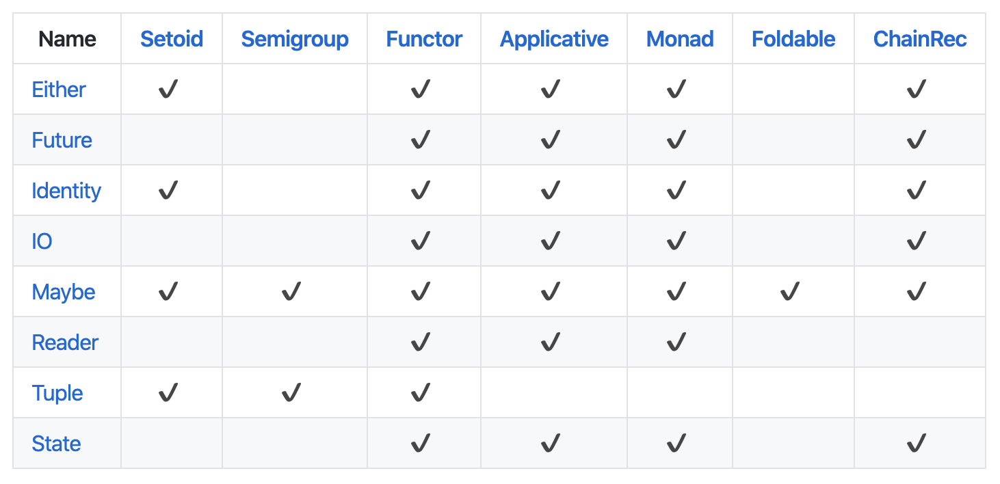

> 자바스크립트로 하는 함수형 프로그래밍에 대해서 글을 써볼까 합니다. 우연한 기회로 함수형 프로그래밍에 대한 관심을 갖게 됐고, 프론트엔드 개발을 하면서 적용했던 함수형 프로그래밍에 대해서 다뤄볼 예정입니다.

**[시작 글: 코드 스타일](/fp-in-js-1-code-style)**

**[두 번째 글: 함수 컴포지션, 커링](/fp-in-js-2-composition-currying)**

**[세 번째 글: 함수형 프로그래밍의 특징](/fp-in-js-3-about-fp)**

**[네 번째 글: 펑터, Maybe](/fp-in-js-4-functor-maybe)**

**[다섯 번째 글: Either](/fp-in-js-5-either)**

**[여섯 번째 글: Either](/fp-in-js-6-io-future)**

펑터는 map 이라는 메소드를 구현한 구조체라고 할 수 있습니다. 공통 적으로 상자 안에 값을 넣는다는 개념을 가지고 있고, 이 값을 변경하기 위해 map 메소드를 이용합니다.

```js
Maybe.of(1).map(add(2)); // Just(3)
Nothing(1).map(add(2)); // Nothing

Either.Right(1).map(add(2)); // Right(3)
Either.Left(1).map(add(2)); // Left(1)

IO.of(1).map(add(2)) // IO(3)
Future.of(1).map(add(2)) // Future(3)
```

값을 변경한 반환 값을 갖고있는 같은 타입의 펑터 입니다.

함수형 프로그래밍에서 예외처리나 I/O 작업을 하기 위해 펑터를 적절히 사용하면 우아한 코드를 만들어 낼 수 있습니다.

그런데 이 펑터를 이용하다보면 다른 타입의 펑터끼리 연결해야 하는 경우가 생깁니다. 이 때 생기는 문제점에 대해서 먼저 살펴보고, 그 문제점을 어떻게 처리해야 하는지까지 같이 살펴보도록 하겠습니다.

## map, map, map...

Either를 소개했던 글에서 봤던 예제를 다시 살펴보도록 하겠습니다.

```js
const books = [
  { id: 'book1', title: 'coding with javascript', author: 'Chris Minnick, Eva Holland' },
  { id: 'book2', title: 'speaking javaScript', author: 'Axel Rauschmayer' },
];
```

위와 같이 책 목록이 있습니다. 각 id와 title 그리고 author 값을 갖고있습니다. 책 id를 이용해서 책을 찾습니다. 이 책이 Axel 작가의 책인경우 title을 출력해 줍시다.

### 재료(함수) 만들기

우선 id로 책을 찾는 함수를 하나 만들어 줍니다. id에 해당하는 책이 없을 수 있기 때문에 Maybe를 펑터를 이용합니다.

```js
import { curry, find, pipe, propEq } from 'ramda';

const getBookById = curry((books, id) => {
  return pipe(
    find(propEq('id', id)),
    Maybe.of
  )(books)
});

getBookById(books, 'book'); // Nothing
getBookById(books, 'book1'); // Just({id: 'book1', ...})
```

id에 해당하는 책이 없을 경우 Nothing을 반환하고, 책이 있을 경우 Just를 반환하게 됩니다.

그럼 다음으로 Axel 작가의 책인지 확인하는 함수를 만들어 보도록 하겠습니다.

```js
const validateAuthor = (book) => {
  return book.author.indexOf('Axel') > -1 ? Maybe.of(book) : Maybe.of(null);
}
```

책의 작가 이름에서 Axel이 포함된 경우 Just를 그렇지 않은 경우 Nothing을 반환하도록 Maybe에 null을 넘겨줍니다.

마지막으로 로그를 찍어줄 함수를 만들어 줍니다. object에서 특정 필드 값을 로그에 찍어주도록 해 줍니다.

```js
const logProp = curry((prop, value) => {
  console.log(value[prop]);
});
```

### 재료(함수) 조합하기

이제 지금까지 만들었던 함수를 조합해서 우리가 원하는 결과를 만들어보도록 합시다. pipe의 첫 번째 함수로 `getBookById(books)`를 넣어 줍니다. `getBookById` 함수가 커링된 함수기 때문에 책 id를 받는 새로운 함수가 됩니다. 이 함수에 아이디를 넘겨주면 Maybe를 반환하게 됩니다.

```js
const printAxelBookTitle = pipe(
  getBookById(books)
);

printAxelBookTitle('book2'); // Just({id: 'book2', ...})
```

이제 이렇게 찾은 책이 Axel 작가의 책인지 검사하도록 합니다. Just인 경우가 책을 찾은 경우기 때문에 map을 이용해서 책에 접근해야 합니다. `map(validateAuthor)`를 두 번째 인자로 넘겨서 책이 Axel 작가의 책인지 검사해 줍니다.

```js
const printAxelBookTitle = pipe(
  getBookById(books),
  map(validateAuthor)
);

printAxelBookTitle('book2'); // Just(Just({id: 'book2', ...}))
```

validateAuthor 함수의 반환 값이 Maybe이기 때문에 `printAxelBookTitle`의 반환 값은 `Just(Just({id: 'book2', ...}))`가 됩니다.

이제 마지막으로 책의 title을 출력하기 위해 logProp 함수를 이용하도록 합시다.

```js
const printAxelBookTitle = pipe(
  getBookById(books),
  map(validateAuthor),
  map(map(logProp('title')))
);

printAxelBookTitle('book2'); // speaking javaScript
```

이전 반환 값이 Just 내부에 Just 가 있는 형태이기 때문에 책에 접근하기 위해서는 map을 두 번 써줘야 합니다. 첫 번째 map을 이용해서 Just 한 겹 안으로 들어가서 `Just({id: 'book2', ...})`에 접근합니다. 다음으로 두 번째 map을 이용해서 책에 접근할 수 있게 됩니다.

### 깊어지는 펑터

우리가 원하는 목적은 달성 했지만 뭔가 `map(map(...))`은 깔끔해 보이지 않습니다. 이렇게 펑터를 이용해서 함수 합성을 이용하다 보면 펑터가 들고 있는 값이 펑터인 경우가 생깁니다.

```js
const mOne = Maybe.of(1);
const mmTwo = Maybe.of(Maybe.of(2));
const mmmThree = Maybe.of(Maybe.of(Maybe.of(3)));
const mmmmFour = Maybe.of(Maybe.of(Maybe.of(Maybe.of(4))));

map(console.log, mOne); // 1
map(map(console.log), mmTwo) // 2
map(map(map(console.log)), mmmThree) // 3
map(map(map(map(console.log))), mmmmFour) // 4
```

지금은 펑터가 두 겹으로 감싸져 있지만 여러 단계로 감싸져 있다면 map의 단계도 점점 깊어지게 되겠죠. 어떻게 해야 깔끔한 코드를 만들 수 있을까요?

## 한 겹 먼저 벗겨내기

우리가 만든 `printAxelBookTitle` 함수는 pipe의 마지막 함수로 `map(map(logProp('title')))`을 넘겨줬습니다. Just 안의 Just 안의 책에 접근하기 위해서였죠. 이 과정을 조금 양보해서 첫 번째 Just의 값을 먼저 꺼내고 다음으로 Just 내부에 있는 책에 접근하는 방식으로 사용해 보도록 하죠.

### 생으로 벗겨내기

가장 간단하게 벗겨내기 위한 방법은 펑터가 들고있는 값을 반환해주면 됩니다.

```js
const printAxelBookTitle = pipe(
  getBookById(books),
  map(validateAuthor),
  maybe => maybe.$value,
  map(logProp('title'))
);

printAxelBookTitle('book2'); // speaking javaScript
```

세 번째 pipie의 함수는 `Just(Just({id: 'book2', ...}))`를 받아서 Just를 한꺼풀 벗겨낸 `Just({id: 'book2', ...})` 를 반환합니다. 그러면 map을 한번만 써서 책에 접근할 수 있게 됩니다.

### getOrElse

이전에 Maybe를 소개할 때에도 maybe.\$value와 같은 형태를 썼었는데요. Nothing을때 기본값을 반환하기 위해 사용했던 함수가 있습니다. `getOrElse` 함수입니다.

```js
const getOrElse = curry((defaultValue, fn, maybe) => {
  return maybe.isNothing ? defaultValue : fn(maybe.$value);
});

getOrElse(0, add(1), Maybe.of(1)); // 2
getOrElse(0, add(1), Maybe.of(null)); // 0
```

이 전에는 세 개의 인자를 받도록 했었는데 두 번째 인자가 변환함수였죠. 이 두 번째 함수를 제거하고 값을 바로 반환해주도록 바꾸겠습니다.

```js
const getOrElse = curry((defaultValue, maybe) => {
  return maybe.isNothing ? defaultValue : maybe.$value;
});

getOrElse(0, Maybe.of(1)); // 1
getOrElse(0, Maybe.of(null)); // 0
```

이제 함수를 Maybe의 메소드로 만들어 보도록 하겠습니다.

```js
class Maybe {
  constructor(value) {
    this.$value = value;
  }

  static of(value) {
    return new Maybe(value);
  }

  get isNothing() {
    return this.$value === null || this.$value === undefined;
  }

  map(fn) {
    return this.isNothing ? this : Maybe.of(fn(this.$value));
  }

  getOrElse(defaultValue) {
    return this.isNothing ? defaultValue : this.$value;
  }

  toString() {
    return this.isNothing ? 'Nothing' : `Just(${this.$value})`
  }
}
```

getOrElse를 Maybe 메소드로 구현했으니 이 메소드를 이용하도록 getOrElse 함수를 바꿔보도록 합시다.

```js
const getOrElse = curry((defaultValue, maybe) => {
  return maybe.getOrElse(defaultValue);
});

getOrElse(0, Maybe.of(1)); // 1
getOrElse(0, Maybe.of(null)); // 0
```

자 그럼 이 getOrElse 함수를 이용해서 `printAxelBookTitle`를 수정합니다.

```js
const printAxelBookTitle = pipe(
  getBookById(books),
  map(validateAuthor),
  getOrElse(''),
  map(logProp('title'))
);

printAxelBookTitle('book2'); // speaking javaScript
```

## 모나드

자 이렇게 펑터 map을 이용한 결과가 새로운 펑터를 반환하는 경우 getOrElse 함수를 이용해서 바깥쪽 펑터를 하나 벗겨낼 수 있게 됐습니다.

```js
const addOneToMaybe = (value) => {
  return Maybe.of(value + 1);
}

pipe(
  map(addOneToMaybe),
  getOrElse(0)
)(Maybe.of(1)); // Just(2)
```

### 같은 타입으로 연결

이 map + getOrElse의 조합을 함수로 뽑아내서 한번에 수행하도록 바꾸겠습니다.

```js
const chain = curry((fn, maybe) => {
  return maybe.map(fn).getOrElse(null);
});

chain(addOneToMaybe, Maybe.of(1)); // Just(2)
```

이제 map + getOrElse를 chain 함수 하나로 바꿀 수 있게 됐습니다.

`printAxelBookTitle`에 적용해보도록 할까요?

```js
const printAxelBookTitle = pipe(
  getBookById(books),
  chain(validateAuthor),
  map(logProp('title'))
);

printAxelBookTitle('book2'); // speaking javaScript
```

이제 getOrElse를 Maybe 메소드로 넣은것 처럼 Maybe에도 chain 메소드를 추가하도록 하겠습니다.

chain 메소드를 추가하기 전에 chain 함수 다른 방식으로 구현하면 아래와 같이 쓸 수 있습니다.

```js
const chain = curry((fn, maybe) => {
  // return maybe.map(fn).getOrElse(null);
  return fn(maybe.$value);
});

chain(addOneToMaybe, Maybe.of(1)); // Just(2)
```

fn의 결과는 새로운 펑터이기 때문에 map을 이용해 fn을 적용하면 `펑터(펑터(값))` 형태가 됩니다. 여기서 필요없는 바깥 펑터를 벗겨내기 위해 getOrElse를 사용했습니다. 이렇게 생각해보면 어떨까요? 굳이 map으로 펑터를 감싸지 않으면 getOrElse를 쓰지 않아도 되지 않아도 될것 같습니다.

그래서 maybe.\$value를 fn에 바로 적용하면 fn함수 자체가 펑터를 반환하기 때문에 복잡하게 펑터를 감쌌다가 다시 풀어주는 행동을 할 필요가 없어지게 됩니다.

chain 메소드를 위 방법대로 추가하도록 하겠습니다.

```js
class Maybe {
  constructor(value) {
    this.$value = value;
  }

  static of(value) {
    return new Maybe(value);
  }

  get isNothing() {
    return this.$value === null || this.$value === undefined;
  }

  map(fn) {
    return this.isNothing ? this : Maybe.of(fn(this.$value));
  }

  getOrElse(defaultValue) {
    return this.isNothing ? defaultValue : this.$value;
  }

  chain(fn) {
    return this.isNothing ? this : fn(this.$value);
  }

  toString() {
    return this.isNothing ? 'Nothing' : `Just(${this.$value})`
  }
}
```

그리고 chain 함수를 Maybe의 chain 메소드를 이용하도록 바꾸겠습니다. 이렇게 하면 `printAxelBookTitle`는 변경없이 그대로 잘 동작하게 됩니다.

```js
const chain = curry((fn, maybe) => {
  return maybe.chain(fn);
});

const printAxelBookTitle = pipe(
  getBookById(books),
  chain(validateAuthor),
  map(logProp('title'))
);

printAxelBookTitle('book2'); // speaking javaScript
```

Maybe를 처음 소개했던 글 이후로 우리는 Maybe를 펑터 라고 불렀습니다. 왜냐하면, Maybe는 map이라는 메소드를 구현했기 때문이죠. 오늘 이 map 메소드 이후로 추가한 메소드가 두개가 있습니다. 하나는 getOrElse이고 또 하나는 chain 입니다.

이 `chain` 메소드를 구현하는 순간 우리는 Maybe를 다른 이름으로 부를 수있게 됩니다. 바로, `모나드(Monad)`입니다.

> **모나드(Monad)**
>
> 1. chain 메소드를 구현한 객체다.
> 2. chain 메소드는 모나드가 가진 값에 함수를 적용해서 새로운 모나드를 반환해야 한다.

모나드의 정의가 약간 복잡해 보일 수 있는데, 조금더 쉽게 이해하기 위해서 펑터의 정의와 비교해 보도록 하겠습니다.

펑터의 조건인 map 메소드는 자기 자신과 같은 타입을 반환하기 위해 다시 한 번 같은 타입의 펑터로 감싸서 반환했습니다. 즉, Maybe는 `fn(this.$value)`를 `Maybe.of`로 다시 한 번 감싸서 Maybe 타입을 반환하도록 구현했습니다.

```js
map(fn) {
  return this.isNothing ? this : Maybe.of(fn(this.$value));
}
```

반면 `chain은 fn 함수가 같은 타입의 모나드를 반환하지 않아도 상관이 없습니다`. chain 메소드는 이중 펑터의 바깥의 한 겹을 벗겨낸다고 생각하면 될것 같습니다. 쉽게 생각하면 A라는 타입의 모나드를 이용해서 B라는 전혀 새로운 타입의 모나드로 변경하고 싶을때 사용하면 됩니다. 예를 들면, `Maybe 타입을 Either 타입으로 변경`한다고 생각하면 될것 같습니다.

```js
chain(fn) {
  return this.isNothing ? this : fn(this.$value);
}
```

chain의 구현을 보면 chain의 파라미터로 받은 fn 함수를 \$value에 바로 적용해 줍니다. fn 함수는 새로운 모나드 타입을 반환하는 함수입니다. 즉, 결과적으로 A 타입의 펑터가 fn에서 반환하는 B 타입의 펑터로 변경이 되게 됩니다.

### 다른 타입으로 연결

우리가 계속해서 살펴봤던 예제를 살짝 바꿔볼까요?

`getBookById`와 `validateAuthor` 함수는 모두 Maybe를 반환했습니다. 여기서 `validateAuthor` 함수를 Maybe가 아닌 Either를 반환하도록 하겠습니다.

```js
const validateAuthor = (book) => {
  return book.author.indexOf('Axel') > -1 ? Either.right(book) : Either.left(null);
}
```

이렇게 하면 `getBookById`는 Myabe를 `validateAuthor`은 Either를 반환합니다. 이제 chain을 이용해서 구현을 바꿔볼까요?

```js
const printAxelBookTitle = pipe(
  getBookById(books),
  chain(validateAuthor),
  map(logProp('title'))
);

printAxelBookTitle('book2'); // speaking javaScript
```

단순히 `validateAuthor`의 반환 타입만 바뀌었을 뿐 `printAxelBookTitle`의 변경되는 사항은 없습니다. 하지만 세부적은 타입은 달라지게 돼죠.

`validateAuthro`이 Maybe 타입을 반환할때는 `chain(validateAuthor)`의 결과는 Just 타입이 됩니다.

```js
const printAxelBookTitle = pipe(
  getBookById(books),
  chain(validateAuthor), // Just({id: 'book2', ...}
  map(logProp('title'))
);

printAxelBookTitle('book2'); // speaking javaScript
```

하지만 Either를 반환하게 바꾸고 난 후의 `chain(validateAuthor)`의 결과는 Right가 됩니다.

```js
const printAxelBookTitle = pipe(
  getBookById(books),
  chain(validateAuthor), // Right({id: 'book2', ...}
  map(logProp('title'))
);

printAxelBookTitle('book2'); // speaking javaScript
```

여기서 우리가 확인할 수 있는 사실은 **'어떤 함수의 반환값이 어떠한 값일 지라도 펑터인 경우 map을 이용해서 연결할 수 있다.'** 라는 점입니다.

Maybe이건 Either이건 모두 map을 구현한 펑터이기 때문에 반환 타입에 상관없이 자연스럽게 map으로 연결이 가능해진 겁니다.

### 모나드 Either

잠시 모나드의 두 번째 정의를 다시 한 번 살펴볼까요?

> chain 메소드는 모나드가 가진 값에 함수를 적용해서 **새로운 모나드를 반환**해야 한다.

그렇습니다. chain은 새로운 모나드를 반환해야 합니다. Maybe에는 chain 메소드를 구현했기 때문에 모나드라고 할 수 있습니다. 하지만 두 번째 정의에서 새로운 모나드를 반환해야 한다는 부분에서는 Either가 아직 모나드라고 할 수 없습니다.

왜냐하면 chain 메소드를 구현하지 않았기 때문이죠. Either도 모나드로 만드기 위해 chain 메소드를 구현하도록 하겠습니다.

Either는 두 가지 상태로 나뉘었습니다. 정상적인 상태는 Right, 에러 상황일때는 Left였죠.

각 상태에 대해서 구현이 다르기 때문에 하나씩 나눠서 살펴보겠습니다.

**Right**

정상적인 값을 가진 Right 상태부터 살펴보겠습니다. chain 메소드는 Maybe가 Nothing이 아닐때와 마찬가지로 현재 값에 함수를 적용한 결과를 반환하도록 합니다.

```js
chain(fn) {
  return fn(this.$value);
}
```

**Left**

그리고 에러 상황인 Left입니다. Left는 Nothing인 상태와 마찬가지로 값에 대해서 처리할 필요가 없기 때문에 자기 자신을 그대로 돌려주면 될것 같습니다.

```js
chain(fn) {
  return this;
}
```

아래는 펑터이자 모나드인 Either의 구현입니다.

```js
class Either {
  constructor(value){
    this.$value = value;
  }

  static right(value) {
    return new Right(value)
  }

  static left(value) {
    return new Left(value);
  }
}

class Right extends Either {
  get isRight() {
    return true;
  }

  get isLeft() {
    return false
  }

  map(fn) {
    return new Right(fn(this.$value));
  }

  getOrElse() {
    return this.$value;
  }

  chain(fn) {
    return fn(this.$value);
  }
}

class Left extends Either {
  get isRight() {
    return false;
  }

  get isLeft() {
    return true;
  }

  map(fn) {
    return this;
  }

  getOrElse(defaultValue) {
    return defaultValue;
  }

  chain(fn) {
    return this;
  }
}
```

이제 validateAuthor의 결과도 Either 모나드이기 때문에 얼마든지 다시 chain을 이용해서 새로운 모나드를 연결해 줄 수 있습니다.

```js
const validateTitleLength = (title) => {
  return title.length > 20 ? Maybe.of(null) : Maybe.of(title);
}

const printAxelBookTitle = pipe(
  getBookById(books),
  chain(validateAuthor), // Right({id: 'book2', ...}
  map(prop('title')),
  chain(validateTitleLength), // Just({id: 'book2', ...})
  map(toUpper),
  map(console.log)
);

printAxelBookTitle('book2'); // SPEAKING JAVASCRIPT
```

## 펑터(Functor)와 모나드(Monad)

펑터와 모나드는 각자 특정 조건을 만족하는 메소드를 구현했을 때 붙일 수 있는 별명이라고 생각하면 될것 같습니다.

상자에 map 메소드가 존재하는데 이 메소드의 결과가 같은 상자 타입이라면 이 상자는 `펑터`라는 별명을 갖게 됩니다.

그리고 상자에 chain 메소드가 존재하는데 새로운 타입의 모나드를 반환한다면 펑터와 마찬가지로 이 상자는 `모나드`라는 별명을 갖게 됩니다.

아래 표는 [ramda-fantsy](https://github.com/ramda/ramda-fantasy) 라는 라이브러리에서 제공하는 타입입니다.



이 표에서 볼수 있듯 우리가 살펴봤던 `Either, Future, IO, Maybe` 외에도 더 많은 타입이 존재 합니다. 이 타입들이 Functor, Monad에 체크표시가 된경우는 map과 chain 메소드를 구현했다고 생각하면 됩니다.

펑터와 모나드라는 별명이 공존할 수 있다는 뜻이겠죠. 즉, 어떤 타입의 객체든 펑터와 모나드의 조건만 갖추면 펑터와 모나드로 불릴수 있다는 뜻입니다.

이 라이브러리는 이 표를 보여드리기 위한 소개 정도만 보시면 될것 같습니다. 지금은 유지보수를 하지 않기 때문에 다른 라이브러리를 사용하도록 권장하고 있습니다.

## 정리

오늘은 모나드 체이닝에 대해서 살퍄봤습니다. 모나드라는 개념이 나오기 전 펑터에 map을 이용해 새로운 함수를 적용한 결과가 펑터인 경우 `펑터(펑터(값))`의 형태가 됩니다.

map을 펑터가 겹쳐진 갯수만큼 써서 `map(map(함수))`형태로 값에 변경을 가할 수 있었지만 보기 좋은 형태는 아니었죠. 이를 깔끔하게 해결하기 위해 모나드를 만들어 처리했습니다.

> **모나드(Monad)**
>
> 1. chain 메소드를 구현한 객체다.
> 2. chain 메소드는 모나드가 가진 값에 함수를 적용해서 새로운 모나드를 반환해야 한다.

모나드 타입을 만족시켜주는 chain 메소드를 이용해 `기존 펑터(값)`을 `새로운 펑터(새로운 값)`의 형태로 자연스럽게 연결하도록 처리했습니다. 여기서 `기존 펑터`와 `새로운 펑터`는 모두 chain 메소드를 구현하기 때문에 **모나드**라는 표현이 더 정확한 표현입니다.

이 모나드를 이용하면 map(map(...)) 과 같은 map 중첩 없이 항상 값을 감싸는 하나의 상자 형태로 함수 합성이 가능해지는것을 확인했습니다.

새로운 개념인 모나드가 나오면서 약간은 헷갈리셨을지 모르겠습니다. 펑터와 마찬가지로 특정 조건을 만족하는 chain 메소드를 구현했을때 부를 수 있는 새로운 별명정도라고 생각하면 쉬울 수 있습니다.

## 다음은?

펑터와 모나드에 이어 Applicative에 대해서 살펴보도록 하겠습니다.
