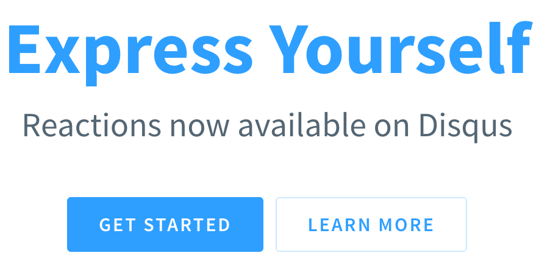
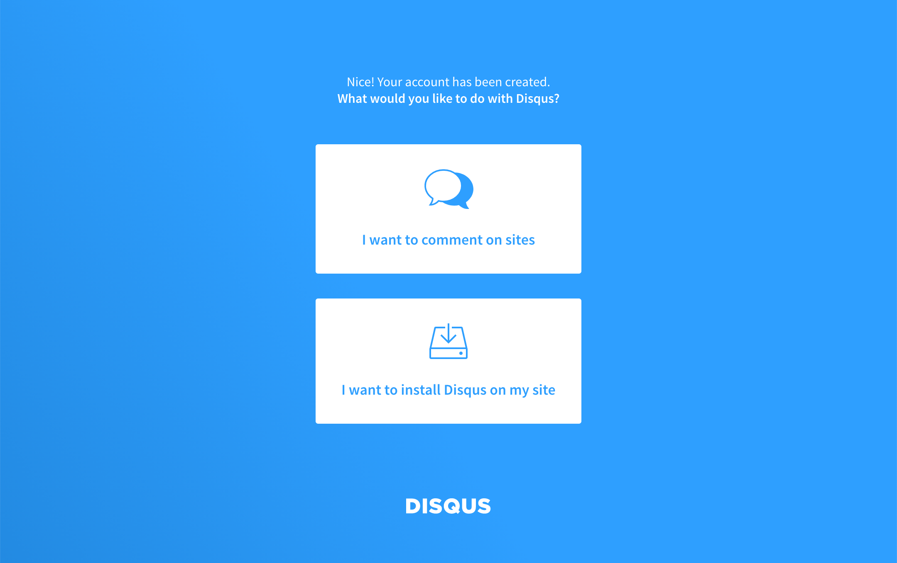
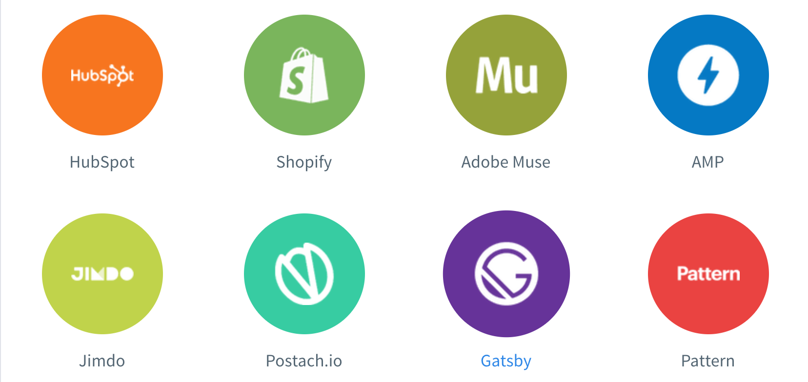
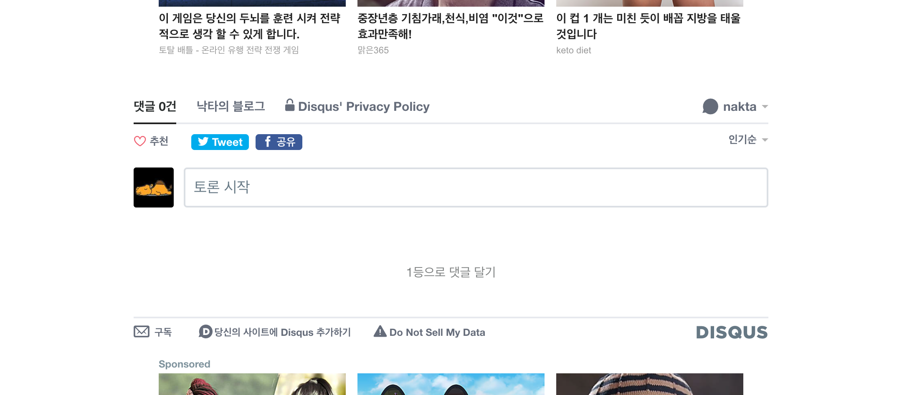
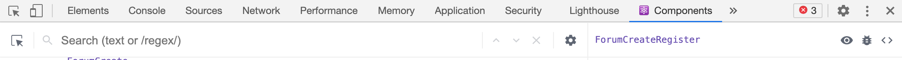
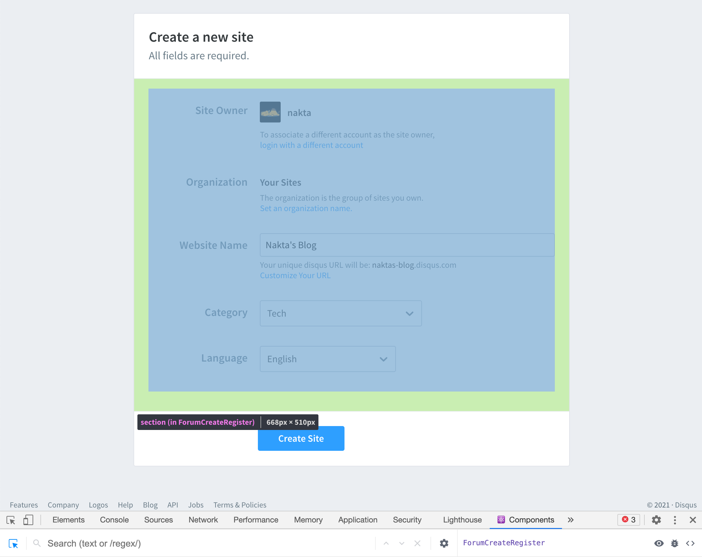
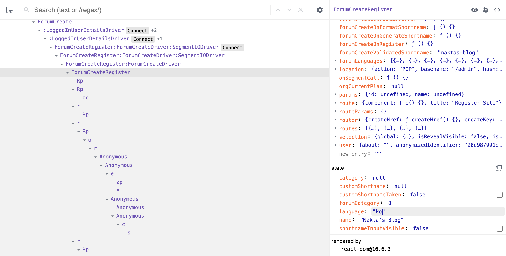
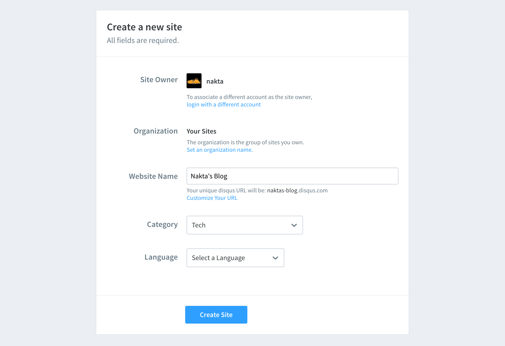

시간날때마다 블로그를 만들어 보는데 피드백이 있어야 좋을것 같은 생가이 듭니다. 그래서 댓글 기능을 넣어 볼까 합니다.
Gatsby 기반의 블로그에 댓글 기능을 넣기위한 방법 중 하나로 디스커스 서비스를 이용할 수 있습니다.

## 디스커스?

한마디로 **댓글기능을 제공해 주는 서비스**입니다.
홈페이지에 들어가면 여러가지 소개를 하는데 그 중 눈에 띄는 부분이 있습니다.

```
On average, sites with Disqus gain:

1. Increase of +23% time spent per visit.
2. Increase of +13% of pageviews per visit.
3. Over 50% of article views include comment reads.
```

뭔가 디스커스를 쓰면 사람들이 반응도 많이 해주고 글도 많이 읽을거다 이런 내용입니다.
그럼 디스커스를 이용해서 댓글 기능을 넣어보도록 합시다.

## 사이트 추가

디스커스 서비스를 이용하기 위해 우선 해야할 일은 디스커스에 댓글 기능을 넣어줄 사이트를 추가해줘야 합니다.
https://disqus.com/ 여기에 접속해서 간단하게 가입을 해주고 **Get Started**를 눌러줍니다.



그러면 디스커스로 뭘 하고 싶은지 물어보게 되는데요.
우리는 사이트에 댓글 기능을 넣고 싶으니 **I want to install Disqus on my site**를 눌러 줍니다.



이제 사이트 정보를 입력하면 됩니다.

**[Tip. 언어 한국어 설정하기](#tip-language-한국어-설정하기)**

사이트 정보를 입력하고 나면 플랜을 선택해야 하는데요. 여러가지 플랜이 있지만 우리는 무료버전을 선택합니다.
무료 플랜인 Basic은 무료인 만큼 큰 단점이 있는데요. 댓글창 주변으로 광고가 들어간다는 점입니다... :(

여기까지하면 사이트 등록은 끝입니다. 이제 등록을 했으니 Gatsby에서 설정해주도록 하겠습니다.

## Gatsby 설정하기

이제 플랫폼 별로 설치 가이드를 제공해주는데요. 우리는 Gatsby를 선택해줍니다.



그리고 가이드에 나와있는 데로 Gatsby에서 디스커스를 사용하기 위해서 플러그인을 하나 설치해주도록 합니다.

```sh
npm i --save gatsby-plugin-disqus
```

그리고 2번에 있는 `gatsby-coinfig.js`에서 플러그인 설정을 그대로 붙여넣기 해주면 됩니다.
여기서 shrotname이라는 값을 options에 넣어주게 돼있는데요. 이 값은 디스커스에 사이트를 추가하면 사이트별로 부여되는 값입니다.

가이드 페이지에 나오는 shrotname은 방금 추가한 사이트에 부여된 값이므로 그대로 넣어주면 됩니다.

## 댓글 컴포넌트 추가하기

이제 설정은 끝났으니 댓글 기능을 제공해줄 컴포넌트를 하나 만들어보겠습니다.
`gatsby-plugin-disqus`에서 제공하는 `Disqus`컴포넌트를 이용합니다.

```tsx
import { Disqus } from 'gatsby-plugin-disqus';

type Props = {
  siteUrl: string;
  path: string;
  title: string;
};

const Comment = ({ siteUrl, path, title }: Props) => {
  const config = {
    url: `${siteUrl}${path}`, // 페이지 주소
    identifier: path, // 페이지의 유니크한 값
    title, // 페이지 제목
  };
  return <Disqus config={config} />;
};

export default Comment;
```

이때 `Disqus` 컴포넌트의 prop 값으로 url, identifier, title을 넘겨주는데요.
url은 현재 페이지의 전체 URl을 넣어주면 됩니다.
그리고 identifier는 페이지별로 유니크한 값을 넣어주면 되는데요. 어차피 path가 유일한 값일테니 path를 그대로 사용합니다.
그리고 title에는 현재 페이지의 title 값을 넘겨줍니다.

이제 각 포스트 페이지에서 적당히 원하는 위치로 Comment 컴포넌트를 렌더링 해주면 되겠습니다.

```tsx
...
<MDXRenderer>{body}</MDXRenderer>
<Comment siteUrl={siteUrl} path={path} title={title} />
...
```

그러면 이렇게 디스커스 댓글창이 나타나게 됩니다.
다만 우리는 무료 플랜을 선택했으므로 저렇게 댓글창 위 아래로 광고가 노출되게 됩니다.



<br />
<br />
<br />

### Tip. Language 한국어 설정하기

사이트 정보 입력 폼을 보면 언어 정보를 선택할 수 있습니다. 그런데 한국어가 없습니다.
영어로 설정해도 크게 상관은 없지만 그래도 한국어를 선택하고 싶다면 꼼수를 이용할 수 있습니다.

디스커스는 React를 이용해 구현했나 봅니다. React Devtools가 활성화 돼있습니다.
React devtools를 설치하면 React로 만들어진 사이트에 접속할때 Devtools가 활성화 됩니다.

우린 Gatsby에 설치하는 거니 React 개발자도구는 당연히 잘 쓸수 있을거라 생각합니다.
이걸 이용해서 Select 목록에 없는 한국어를 설정해줄 수 있습니다.

개발자도구를 열어서 Components 탭으로 가줍니다.



개발자 도구 내에 있는 컴포넌트 검사 선택 도구로 저 폼을 감싸주는 부분을 선택해 줍니다.


그러면 개발자도구 우측에 컴포넌트의 상태값이 나오는데요. 아래쪽으로 내려가면 state가 있습니다.
여기에 있는 `language`를 `ko`로 강제로 바꿔줍시다.


이렇게 바꾸고나면 입력 폼에 Langage 필드가 Select a Language로 보입니다.
Select에 있는 옵션 목록중에 해당하는 값이 없어서 저렇게 렌더링 되는것 같습니다.
이 상태로 **Create Site**를 눌러주면 됩니다.


