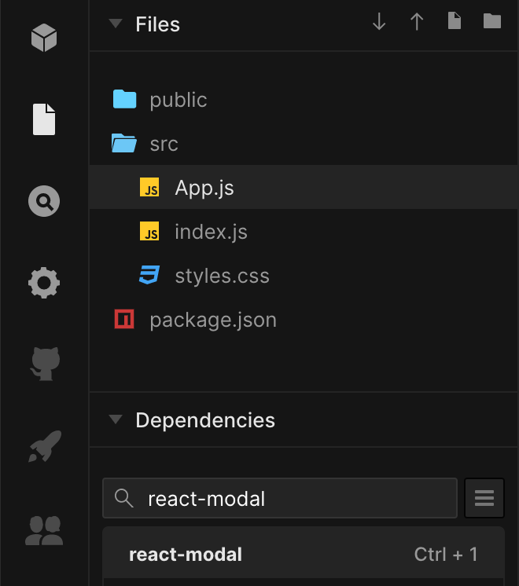

import { CodeWave } from 'gatsby-theme-waves';

리액트는 컴포넌트 기반의 UI 라이브러리 입니다. 이러한 특성 덕분에 화면에 보여주고 싶은 UI는 컴포넌트를 만들어서 조합해 사용합니다.
리액트에서의 모달도 이와 다르지 않은데요. 모달을 렌더링 하기 위해서 모달 컴포넌트를 만들어서 렌더링 해줘야 합니다.
이 때 발생하는 몇 가지 불편한 점과 어떻게 개선하면 좋을지 살펴보도록 하겠습니다.

## 준비하기

리액트에서 모달을 직접 구현하기 귀찮으니 구글에서 react modal을 검색해 봅니다.
현재 날짜 기준으로는 [react-modal](https://github.com/reactjs/react-modal) 이라는 라이브러리가 바로 보이는데 이걸 이용해보겠습니다.

저는 귀찮아서 [CodeSandbox](https://codesandbox.io/) 라는 멋진 서비스를 사용하도록 하겠습니다.
여기서는 CodeSandbox에 대해서는 자세히 설명하지 않겠습니다. 그냥 온라인상에서 빠르게 코딩을 할 수 있는 서비스라고 생각하면 이해가 쉬울것 같습니다.

CodeSandbox로 React 템플릿을 이용해서 만든 후에 좌측을 보면 dependency를 추가할 수 있습니다.
여기에 react-modal을 검색해서 추가해주도록 합니다.


이렇게 하면 빠르게 테스트 해볼 수 있는 환경이 생겼습니다.

## 모달 컴포넌트 준비하기

이제 모달을 이용해 보도록 하겠습니다.

<CodeWave>

```jsx
import { StrictMode } from 'react';
import ReactDOM from 'react-dom';

import App from './App';

const rootElement = document.getElementById('root');
ReactDOM.render(
  <StrictMode>
    <App />
  </StrictMode>,
  rootElement,
);
```

react-modal GitHub에 README를 읽어보면 처음에 모달을 렌더링할때 기준이 되는 엘리먼트를 지정해줘야 한다고 합니다.

리액트를 앱을 렌더링 해주는 root 엘리먼트를 똑같이 지정하면 될것 같습니다.

```jsx
import { StrictMode } from 'react';
import ReactDOM from 'react-dom';
import ReactModal from 'react-modal';

import App from './App';

ReactModal.setAppElement('#root');

const rootElement = document.getElementById('root');
ReactDOM.render(
  <StrictMode>
    <App />
  </StrictMode>,
  rootElement,
);
```

ReactModal의 setAppElement로 `#root`를 지정해줍니다.

```jsx 1:19
// MyModal.jsx

import React from 'react';
import ReactModal from 'react-modal';

const MyModal = () => {
  return (
    <ReactModal>
      <div>모달 입니다.</div>
    </ReactModal>
  );
};

export default MyModal;
```

그리고 react-modal을 이용해서 모달 컴포넌트를 만들어 보도록 하겠습니다.

```jsx
// MyModal.jsx

import React from 'react';
import ReactModal from 'react-modal';

const MyModal = ({ isOpen }) => {
  return (
    <ReactModal isOpen={isOpen}>
      <div>모달 입니다.</div>
    </ReactModal>
  );
};

export default MyModal;
```

ReactModal은 isOpen prop을 받아서 모달의 열고 닫고를 컨트롤 해주기 때문에 MyModal 컴포넌트에도 isOpen을 받아서 ReactModal에 전달할 수 있도록 해줍니다.

</CodeWave>

이제 모달을 사용할 준비가 다된것 같습니다. 이렇게 만들어진 모달 컴포넌트를 가지고 일반적으로 사용하는 법에 대해서 먼저 살펴보도록 하겠습니다.

## 일반적인 방법으로 이용하기

보통은 이렇게 만들어진 모달 컴포넌트는 이 모달을 띄워 줄 수 있는 컴포넌트에 같이 렌더링 해서 사용합니다.

<CodeWave>

```jsx
import MyModal from './MyModal';

const App = () => {
  const handleClick = () => {
    // 여기서 열어준다
  };

  return (
    <div className="App">
      <button onClick={handleClick}>모달 열기</button>
    </div>
  );
};

export default App;
```

App 컴포넌트에서 특정 버튼을 눌렀을때 MyModal을 열어주고 싶다고 생각해봅시다.

```jsx
import MyModal from './MyModal';

const App = () => {
  const handleClick = () => {
    // 여기서 열어준다
  };

  return (
    <div className="App">
      <button onClick={handleClick}>모달 열기</button>
      <MyModal />
    </div>
  );
};

export default App;
```

App 컴포넌트에서 MyModal을 열어줘야 하기 때문에 App 컴포넌트의 렌더링 부분에 MyModal을 같이 렌더링 해서 사용합니다.

```jsx
import MyModal from './MyModal';

const App = () => {
  const [isOpen, setOpen] = useState(false);

  const handleClick = () => {
    // 여기서 열어준다
  };

  return (
    <div className="App">
      <button onClick={handleClick}>모달 열기</button>
      <MyModal isOpen={isOpen} />
    </div>
  );
};

export default App;
```

그리고 모달을 열어주기 위한 isOpen 값을 사용하기 위해서 `useState`도 같이 사용해줍니다.

```jsx
import MyModal from './MyModal';

const App = () => {
  const [isOpen, setOpen] = useState(false);

  const handleClick = () => {
    setOpen(true);
  };

  return (
    <div className="App">
      <button onClick={handleClick}>모달 열기</button>
      <MyModal isOpen={isOpen} />
    </div>
  );
};

export default App;
```

이제 버튼을 눌렀을때 모달을 열어줘야 하기 때문에 onClick 이벤트를 처리하는 함수에서 state 값만 변경해주면 완성입니다.

</CodeWave>

**모달 열기** 버튼을 누르면 이렇게 모달이 열리게 됩니다!


## 일반적인 형태의 몇가지 불편한 부분들

위에 살펴본 방식은 가장 기본적인 방법으로 아주 간단하지만 몇가지 문제가 있습니다.

App 컴포넌트에 **여러개의 모달이 필요**하면 어떻게 될까요?

<CodeWave>

```jsx
import MyModal from './MyModal';

const App = () => {
  const [isOpen, setOpen] = useState(false);

  const handleClick = () => {
    setOpen(true);
  };

  return (
    <div className="App">
      <button onClick={handleClick}>모달 열기</button>
      <MyModal isOpen={isOpen} />
    </div>
  );
};

export default App;
```

### 여러개의 모달이 필요한 경우

지금은 MyModal 하나만 필요하지만 App 컴포넌트에서 여러 모달이 필요하게 되면 더 많은 모달을 렌더링해줘야 합니다.

```jsx
import MyModal1 from './MyModal';
import MyModal2 from './MyModal2';
import MyModal3 from './MyModal3';
import MyModal4 from './MyModal4';

const App = () => {
  const [isOpen, setOpen] = useState(false);

  const handleClick = () => {
    setOpen(true);
  };

  return (
    <div className="App">
      <button onClick={handleClick}>모달 열기</button>
      <button>모달2 열기</button>
      <button>모달3 열기</button>
      <button>모달4 열기</button>
      <MyModal1 isOpen={isOpen} />
      <MyModal2 isOpen={false} />
      <MyModal3 isOpen={false} />
      <MyModal4 isOpen={false} />
    </div>
  );
};

export default App;
```

이렇게 여러 모달이 필요한 경우 필요한 모달을 모두 렌더링해줘야 하겠죠.

```jsx
import MyModal1 from './MyModal';
import MyModal2 from './MyModal2';
import MyModal3 from './MyModal3';
import MyModal4 from './MyModal4';

const App = () => {
  const [isOpen1, setOpen1] = useState(false);
  const [isOpen2, setOpen2] = useState(false);
  const [isOpen3, setOpen3] = useState(false);
  const [isOpen4, setOpen4] = useState(false);

  const handleClick1 = () => {
    setOpen1(true);
  };

  const handleClick2 = () => {
    setOpen2(true);
  };

  const handleClick3 = () => {
    setOpen3(true);
  };

  const handleClick4 = () => {
    setOpen4(true);
  };

  return (
    <div className="App">
      <button onClick={handleClick1}>모달1 열기</button>
      <button onClick={handleClick2}>모달2 열기</button>
      <button onClick={handleClick3}>모달3 열기</button>
      <button onClick={handleClick4}>모달4 열기</button>
      <MyModal1 isOpen={isOpen1} />
      <MyModal2 isOpen={isOpen2} />
      <MyModal3 isOpen={isOpen3} />
      <MyModal4 isOpen={isOpen4} />
    </div>
  );
};

export default App;
```

게다가 모달 컴포넌트에 넘겨줄 isOpen 값을 컨트롤 해야 하기 때문에 useState 값 또한 늘어나게 됩니다.

</CodeWave>

App 컴포넌트에서 모달을 열고 싶을 뿐인데 부수적인 코드가 너무 많아지는 현상이 나타나게 됩니다.
App 컴포넌트 자체적인 로직이 있다면 저런 부수적인 코드도 같이 섞여있어 가독성도 같이 떨어지게 되겠죠.

<CodeWave>

```jsx
// MyModal.jsx

import React from 'react';
import ReactModal from 'react-modal';

const MyModal = ({ isOpen }) => {
  return (
    <ReactModal isOpen={isOpen}>
      <div>모달 입니다.</div>
      <div>
        <button>확인</button>
        <button>취소</button>
      </div>
    </ReactModal>
  );
};

export default MyModal;
```

### Modal 컴포넌트 내부 동작으로 모달을 닫고싶은 경우

모달은 보통 **확인, 취소** 와 같은 버튼들도 같이 존재합니다.

```jsx
// MyModal.jsx

import React from 'react';
import ReactModal from 'react-modal';

const MyModal = ({ isOpen, onSubmit, onCancel }) => {
  const handleClickSubmit = () => {
    onSubmit();
  };

  const handleClickCancel = () => {
    onCancel();
  };

  return (
    <ReactModal isOpen={isOpen}>
      <div>모달 입니다.</div>
      <div>
        <button onClick={handleClickSubmit}>확인</button>
        <button onClick={handleClickCancel}>취소</button>
      </div>
    </ReactModal>
  );
};

export default MyModal;
```

확인 버튼은 보통 비지니스 로직을 처리한 후 모달을 닫아주고, 취소 버튼은 누르는 순간 바로 모달을 닫아줍니다.
이런 동작을 처리하기 위해서 onSubmit과 onCancel과 같은 prop을 받아서 실행해줍니다.

</CodeWave>

<CodeWave>

```jsx
import MyModal1 from './MyModal';
import MyModal2 from './MyModal2';
import MyModal3 from './MyModal3';
import MyModal4 from './MyModal4';

const App = () => {
  const [isOpen1, setOpen1] = useState(false);
  const [isOpen2, setOpen2] = useState(false);
  const [isOpen3, setOpen3] = useState(false);
  const [isOpen4, setOpen4] = useState(false);

  const handleClick1 = () => setOpen1(true);
  const handleClick2 = () => setOpen2(true);
  const handleClick3 = () => setOpen3(true);
  const handleClick4 = () => setOpen4(true);

  return (
    <div className="App">
      <button onClick={handleClick1}>모달1 열기</button>
      <button onClick={handleClick2}>모달2 열기</button>
      <button onClick={handleClick3}>모달3 열기</button>
      <button onClick={handleClick4}>모달4 열기</button>
      <MyModal1 isOpen={isOpen1} />
      <MyModal2 isOpen={isOpen2} />
      <MyModal3 isOpen={isOpen3} />
      <MyModal4 isOpen={isOpen4} />
    </div>
  );
};

export default App;
```

그럼 다시 비대해진 App 컴포넌트를 다시 살펴볼까요? 이제 Modal 컴포넌트는 onSubmit과 onCancel이 필요합니다.

```jsx
import MyModal1 from './MyModal';
import MyModal2 from './MyModal2';
import MyModal3 from './MyModal3';
import MyModal4 from './MyModal4';

const App = () => {
  const [isOpen1, setOpen1] = useState(false);
  const [isOpen2, setOpen2] = useState(false);
  const [isOpen3, setOpen3] = useState(false);
  const [isOpen4, setOpen4] = useState(false);

  const handleClick1 = () => setOpen1(true);
  const handleClick2 = () => setOpen2(true);
  const handleClick3 = () => setOpen3(true);
  const handleClick4 = () => setOpen4(true);

  const handleModal1Submit = () => {
    // 모달1 비지니스 로직
    setOpen1(false);
  };
  const handleModal2Submit = () => {
    // 모달2 비지니스 로직
    setOpen2(false);
  };
  const handleModal3Submit = () => {
    // 모달3 비지니스 로직
    setOpen3(false);
  };
  const handleModal4Submit = () => {
    // 모달4 비지니스 로직
    setOpen4(false);
  };

  const handleModal1Cancel = () => setOpen1(false);
  const handleModal2Cancel = () => setOpen2(false);
  const handleModal3Cancel = () => setOpen3(false);
  const handleModal4Cancel = () => setOpen4(false);

  return (
    <div className="App">
      <button onClick={handleClick1}>모달1 열기</button>
      <button onClick={handleClick2}>모달2 열기</button>
      <button onClick={handleClick3}>모달3 열기</button>
      <button onClick={handleClick4}>모달4 열기</button>
      <MyModal1 isOpen={isOpen1} />
      <MyModal2 isOpen={isOpen2} />
      <MyModal3 isOpen={isOpen3} />
      <MyModal4 isOpen={isOpen4} />
    </div>
  );
};

export default App;
```

각 모달에 onSubmit, onCancel을 추가해볼까요? 우선 onSubmit과 onCancel을 처리해줄 함수를 정의해줍니다.

```jsx
import MyModal1 from './MyModal';
import MyModal2 from './MyModal2';
import MyModal3 from './MyModal3';
import MyModal4 from './MyModal4';

const App = () => {
  const [isOpen1, setOpen1] = useState(false);
  const [isOpen2, setOpen2] = useState(false);
  const [isOpen3, setOpen3] = useState(false);
  const [isOpen4, setOpen4] = useState(false);

  const handleClick1 = () => setOpen1(true);
  const handleClick2 = () => setOpen2(true);
  const handleClick3 = () => setOpen3(true);
  const handleClick4 = () => setOpen4(true);

  const handleModal1Submit = () => {
    // 모달1 비지니스 로직
    setOpen1(false);
  };
  const handleModal2Submit = () => {
    // 모달2 비지니스 로직
    setOpen2(false);
  };
  const handleModal3Submit = () => {
    // 모달3 비지니스 로직
    setOpen3(false);
  };
  const handleModal4Submit = () => {
    // 모달4 비지니스 로직
    setOpen4(false);
  };

  const handleModal1Cancel = () => setOpen1(false);
  const handleModal2Cancel = () => setOpen2(false);
  const handleModal3Cancel = () => setOpen3(false);
  const handleModal4Cancel = () => setOpen4(false);

  return (
    <div className="App">
      <button onClick={handleClick1}>모달1 열기</button>
      <button onClick={handleClick2}>모달2 열기</button>
      <button onClick={handleClick3}>모달3 열기</button>
      <button onClick={handleClick4}>모달4 열기</button>
      <MyModal1
        isOpen={isOpen1}
        onSubmit={handleModal1Submit}
        onCancel={handleModal1Cancel}
      />
      <MyModal2
        isOpen={isOpen2}
        onSubmit={handleModal2Submit}
        onCancel={handleModal2Cancel}
      />
      <MyModal3
        isOpen={isOpen3}
        onSubmit={handleModal3Submit}
        onCancel={handleModal3Cancel}
      />
      <MyModal4
        isOpen={isOpen4}
        onSubmit={handleModal4Submit}
        onCancel={handleModal4Cancel}
      />
    </div>
  );
};

export default App;
```

이렇게 정의한 함수를 각 모달에 prop으로 넘겨주도록 합니다.

```jsx
import MyModal1 from './MyModal';
import MyModal2 from './MyModal2';
import MyModal3 from './MyModal3';
import MyModal4 from './MyModal4';

const App = () => {
  const [isOpen1, setOpen1] = useState(false);
  const [isOpen2, setOpen2] = useState(false);
  const [isOpen3, setOpen3] = useState(false);
  const [isOpen4, setOpen4] = useState(false);

  const handleClick1 = () => setOpen1(true);
  const handleClick2 = () => setOpen2(true);
  const handleClick3 = () => setOpen3(true);
  const handleClick4 = () => setOpen4(true);

  const handleModal1Submit = () => {
    // 모달1 비지니스 로직
    setOpen1(false);
  };
  const handleModal2Submit = () => {
    // 모달2 비지니스 로직
    setOpen2(false);
  };
  const handleModal3Submit = () => {
    // 모달3 비지니스 로직
    setOpen3(false);
  };
  const handleModal4Submit = () => {
    // 모달4 비지니스 로직
    setOpen4(false);
  };

  const handleModal1Cancel = () => setOpen1(false);
  const handleModal2Cancel = () => setOpen2(false);
  const handleModal3Cancel = () => setOpen3(false);
  const handleModal4Cancel = () => setOpen4(false);

  return (
    <div className="App">
      <button onClick={handleClick1}>모달1 열기</button>
      <button onClick={handleClick2}>모달2 열기</button>
      <button onClick={handleClick3}>모달3 열기</button>
      <button onClick={handleClick4}>모달4 열기</button>
      <MyModal1
        isOpen={isOpen1}
        onSubmit={handleModal1Submit}
        onCancel={handleModal1Cancel}
      />
      <MyModal2
        isOpen={isOpen2}
        onSubmit={handleModal2Submit}
        onCancel={handleModal2Cancel}
      />
      <MyModal3
        isOpen={isOpen3}
        onSubmit={handleModal3Submit}
        onCancel={handleModal3Cancel}
      />
      <MyModal4
        isOpen={isOpen4}
        onSubmit={handleModal4Submit}
        onCancel={handleModal4Cancel}
      />
    </div>
  );
};

export default App;
```

App 컴포넌트가 엄청나게 뚱뚱해 집니다.

</CodeWave>

<CodeWave>

```jsx
import MyModal from './MyModal';

const App = () => {
  const [isOpen, setOpen] = useState(false);

  const handleClick = () => {
    setOpen(true);
  };

  return (
    <div className="App">
      <button onClick={handleClick}>모달 열기</button>
      <MyModal isOpen={isOpen} />
    </div>
  );
};

export default App;
```

### 하위 컴포넌트가 모달을 열어야 하는 경우

만약 App 컴포넌트 뿐만 아니라 하위 컴포넌트가 모달을 열어야 하는 상황이 되면 어떨까요?

```jsx
import MyModal from './MyModal';

const App = () => {
  const [isOpen, setOpen] = useState(false);

  const openModal = () => {
    setOpen(true);
  };

  return (
    <div className="App">
      <button onClick={openModal}>모달 열기</button>
      <ChildComponent openModal={openModal} />
      <MyModal isOpen={isOpen} />
    </div>
  );
};

export default App;
```

간단 합니다. 그냥 ChildComponent에 모달을 열어줄 수 있는 함수를 넘겨주고 ChildComponent에서는 이 함수를 실행하기만 하면 되죠.

이런 상황이 뭐가 문제가 되느냐하고 하실 수 있겠지만 개인적으로는 좋은 패턴으로 보이지는 않습니다.

```jsx
import MyModal from './MyModal';

const App = () => {
  const [isOpen, setOpen] = useState(false);

  const openModal = () => {
    setOpen(true);
  };

  return (
    <div className="App">
      <button onClick={openModal}>모달 열기</button>
      <ChildComponent openModal={openModal} />
      <ChildComponent2 openModal={openModal} />
      <ChildComponent3 openModal={openModal} />
      <ChildComponent4 openModal={openModal} />
      <MyModal isOpen={isOpen} />
    </div>
  );
};

export default App;
```

부모 컴포넌트에서 모달을 열기위한 state 관리를 하기 때문에 생기는 현상입니다.

ChildComponent가 지금은 하나지만 만약 아까와 같이 ChildComponent에서도 열 수 있는 상황이 생겨야 한다면 또다시 각 ChildComponent에 openModal 이라는 함수를 넘겨줘야 하기 때문이죠.

</CodeWave>

## 불편한 몇가지 문제들의 효율적인 방향

<CodeWave>

```jsx
import MyModal from './MyModal';

const App = () => {
  const [isOpen, setOpen] = useState(false);

  const openModal = () => {
    setOpen(true);
  };

  return (
    <div className="App">
      <button onClick={openModal}>모달 열기</button>
      <ChildComponent openModal={openModal} />
      <ChildComponent2 openModal={openModal} />
      <ChildComponent3 openModal={openModal} />
      <ChildComponent4 openModal={openModal} />
      <MyModal isOpen={isOpen} />
    </div>
  );
};

export default App;
```

#### 부모의 상태에 의지하지 않고 독립적으로 열 수 있게 만들기 (불필요 props 제거)

만약 모달을 열수 있는 방법이 부모 컴포넌트에 엮여있지 않다고 ChildComponent가 스스로 열수있다면 어떨까요?

```jsx
import MyModal from './MyModal';

const App = () => {
  const [isOpen, setOpen] = useState(false);

  const openModal = () => {
    setOpen(true);
  };

  return (
    <div className="App">
      <button onClick={openModal}>모달 열기</button>
      <ChildComponent />
      <ChildComponent2 />
      <ChildComponent3 />
      <ChildComponent4 />
      <MyModal isOpen={isOpen} />
    </div>
  );
};

export default App;
```

ChildComponent에 openModal이라는 함수를 굳이 모두 넘겨주지 않아도 될것 같습니다.

</CodeWave>

<CodeWave>

```jsx
import MyModal1 from './MyModal';
import MyModal2 from './MyModal2';
import MyModal3 from './MyModal3';
import MyModal4 from './MyModal4';

const App = () => {
  const [isOpen1, setOpen1] = useState(false);
  const [isOpen2, setOpen2] = useState(false);
  const [isOpen3, setOpen3] = useState(false);
  const [isOpen4, setOpen4] = useState(false);

  const handleClick1 = () => setOpen1(true);
  const handleClick2 = () => setOpen2(true);
  const handleClick3 = () => setOpen3(true);
  const handleClick4 = () => setOpen4(true);

  const handleModal1Submit = () => {
    // 모달1 비지니스 로직
    setOpen1(false);
  };
  const handleModal2Submit = () => {
    // 모달2 비지니스 로직
    setOpen2(false);
  };
  const handleModal3Submit = () => {
    // 모달3 비지니스 로직
    setOpen3(false);
  };
  const handleModal4Submit = () => {
    // 모달4 비지니스 로직
    setOpen4(false);
  };

  const handleModal1Cancel = () => setOpen1(false);
  const handleModal2Cancel = () => setOpen2(false);
  const handleModal3Cancel = () => setOpen3(false);
  const handleModal4Cancel = () => setOpen4(false);

  return (
    <div className="App">
      <button onClick={handleClick1}>모달1 열기</button>
      <button onClick={handleClick2}>모달2 열기</button>
      <button onClick={handleClick3}>모달3 열기</button>
      <button onClick={handleClick4}>모달4 열기</button>
      <MyModal1
        isOpen={isOpen1}
        onSubmit={handleModal1Submit}
        onCancel={handleModal1Cancel}
      />
      <MyModal2
        isOpen={isOpen2}
        onSubmit={handleModal2Submit}
        onCancel={handleModal2Cancel}
      />
      <MyModal3
        isOpen={isOpen3}
        onSubmit={handleModal3Submit}
        onCancel={handleModal3Cancel}
      />
      <MyModal4
        isOpen={isOpen4}
        onSubmit={handleModal4Submit}
        onCancel={handleModal4Cancel}
      />
    </div>
  );
};

export default App;
```

#### 상태관리 직접하지 않기

그리고 모달을 열기위한 상태관리를 모달이 필요한 컴포넌트가 직접 하지 않아도 된다면 어떨까요?

```jsx
import MyModal1 from './MyModal';
import MyModal2 from './MyModal2';
import MyModal3 from './MyModal3';
import MyModal4 from './MyModal4';

const App = () => {
  const handleClick1 = () => {
    // 모달을 열수 있는 어떤 다른 방법을 호출
  };
  const handleClick2 = () => {
    // 모달을 열수 있는 어떤 다른 방법을 호출
  };
  const handleClick3 = () => {
    // 모달을 열수 있는 어떤 다른 방법을 호출
  };
  const handleClick4 = () => {
    // 모달을 열수 있는 어떤 다른 방법을 호출
  };

  const handleModal1Submit = () => {
    // 모달1 비지니스 로직
    setOpen1(false);
  };
  const handleModal2Submit = () => {
    // 모달2 비지니스 로직
    setOpen2(false);
  };
  const handleModal3Submit = () => {
    // 모달3 비지니스 로직
    setOpen3(false);
  };
  const handleModal4Submit = () => {
    // 모달4 비지니스 로직
    setOpen4(false);
  };

  const handleModal1Cancel = () => setOpen1(false);
  const handleModal2Cancel = () => setOpen2(false);
  const handleModal3Cancel = () => setOpen3(false);
  const handleModal4Cancel = () => setOpen4(false);

  return (
    <div className="App">
      <button onClick={handleClick1}>모달1 열기</button>
      <button onClick={handleClick2}>모달2 열기</button>
      <button onClick={handleClick3}>모달3 열기</button>
      <button onClick={handleClick4}>모달4 열기</button>
      <MyModal1 onSubmit={handleModal1Submit} onCancel={handleModal1Cancel} />
      <MyModal2 onSubmit={handleModal2Submit} onCancel={handleModal2Cancel} />
      <MyModal3 onSubmit={handleModal3Submit} onCancel={handleModal3Cancel} />
      <MyModal4 onSubmit={handleModal4Submit} onCancel={handleModal4Cancel} />
    </div>
  );
};

export default App;
```

useState를 직접 쓰지 않아도 되기 때문에 뚱뚱한 코드가 조금 더 줄어듭니다.

```jsx
import MyModal1 from './MyModal';
import MyModal2 from './MyModal2';
import MyModal3 from './MyModal3';
import MyModal4 from './MyModal4';

const App = () => {
  const handleClick1 = () => {
    // 모달을 열수 있는 어떤 다른 방법을 호출
  };
  const handleClick2 = () => {
    // 모달을 열수 있는 어떤 다른 방법을 호출
  };
  const handleClick3 = () => {
    // 모달을 열수 있는 어떤 다른 방법을 호출
  };
  const handleClick4 = () => {
    // 모달을 열수 있는 어떤 다른 방법을 호출
  };

  const handleModal1Submit = () => {
    // 모달1 비지니스 로직
  };
  const handleModal2Submit = () => {
    // 모달2 비지니스 로직
  };
  const handleModal3Submit = () => {
    // 모달3 비지니스 로직
  };
  const handleModal4Submit = () => {
    // 모달4 비지니스 로직
  };

  return (
    <div className="App">
      <button onClick={handleClick1}>모달1 열기</button>
      <button onClick={handleClick2}>모달2 열기</button>
      <button onClick={handleClick3}>모달3 열기</button>
      <button onClick={handleClick4}>모달4 열기</button>
      <MyModal1 onSubmit={handleModal1Submit} />
      <MyModal2 onSubmit={handleModal2Submit} />
      <MyModal3 onSubmit={handleModal3Submit} />
      <MyModal4 onSubmit={handleModal4Submit} />
    </div>
  );
};

export default App;
```

#### 모달 액션 후 자동으로 닫아주기 (불필요 props 제거)

한번 더 나아가서 onSubmit과 onCancel 후에 자동으로 닫히게만 만들 수 있다면 코드는 더 줄어들 수 있습니다.

```jsx
const App = () => {
  const handleClick1 = () => {
    // 모달을 열수 있는 어떤 다른 방법을 호출
  };
  const handleClick2 = () => {
    // 모달을 열수 있는 어떤 다른 방법을 호출
  };
  const handleClick3 = () => {
    // 모달을 열수 있는 어떤 다른 방법을 호출
  };
  const handleClick4 = () => {
    // 모달을 열수 있는 어떤 다른 방법을 호출
  };

  const handleModal1Submit = () => {
    // 모달1 비지니스 로직
  };
  const handleModal2Submit = () => {
    // 모달2 비지니스 로직
  };
  const handleModal3Submit = () => {
    // 모달3 비지니스 로직
  };
  const handleModal4Submit = () => {
    // 모달4 비지니스 로직
  };

  return (
    <div className="App">
      <button onClick={handleClick1}>모달1 열기</button>
      <button onClick={handleClick2}>모달2 열기</button>
      <button onClick={handleClick3}>모달3 열기</button>
      <button onClick={handleClick4}>모달4 열기</button>
    </div>
  );
};

export default App;
```

#### 모달 컴포넌트 렌더링 없애기

마지막으로 하나더 필요한 모달을 직접 모두 렌더링 하지 않다도 된다면 컴포넌트가 리턴하는 렌더링 부분도 더 깔끔하게 만들 수 있습니다.
import 없애버릴 수 있겠죠.

</CodeWave>

지금까지 일반적으로 모달을 사용할 때 발생하는 문제점들에 대해서 살펴봤습니다. 이런 문제점들로 인해서 컴포넌트의 코드가 불필요하게 복잡해지고 커진다는 점을 발견했는데요.
이런 것들을 좀더 좋은 방법으로 변경할 수 있다는 가정하에 코드가 많이 줄어드는것을 확인했습니다.

위에서 살펴봤던 개선항목들을 어떻게하면 구현할 수 있을지 같이 살펴보도록 하겠습니다.

- 부모의 상태에 의지하지 않고 독립적으로 열 수 있게 만들기 (불필요 props 제거)
- 상태관리 직접하지 않기
- 모달 액션 후 자동으로 닫아주기 (불필요 props 제거)
- 모달 컴포넌트 렌더링 없애기

## 실질적인 문제와 해결책

위에서 발견한 문제는 사실 모달 관리 방법이 파편화돼있기 때문에 발생하는 문제입니다.

모달이 필요한 컴포넌트별로 각 모달 컴포넌트를 렌더링 하고, 모달을 열어줄 state를 스스로 관리하기 때문에 발생하는 문제입니다.

모달을 사용할 때 가장 핵심적인 내용은 모달을 열고 모달안의 액션에 따라 어떤 비지니스 로직을 처리해줄것이냐 입니다.
하지만 모달을 관리하는 코드때문에 코드가 너무 복잡해진다는데 있죠.

그럼 어떻게 위 개선 방법을 구현할 것이냐? 바로 **파편화된 모달 관리를 효율적으로 한군데서 하자는 아이디어**로 시작합니다.

바로 **중앙화된 모달 관리**라는것이죠.

## 효율적인 모달관리 구현해보자

### 1. State 외부에서 관리하기 (ContextAPI)

App 컴포넌트에서 직접 모달을 열고 닫을 수 있도록 관리하던 state를 외부에서 관리하도록 해주겠습니다.

state 관리 도구는 여러가지가 있습니다만 이 포스트에서는 React에서 제공하는 **ContextAPI**를 사용하는것으로 설명하겠습니다.

<CodeWave>

```jsx
// ModalsContext.js

import { createContext } from 'react';

export const ModalsDispatchContext = createContext({
  // 필요한 함수
});

export const ModalsStateContext = createContext([]);
```

ModalsContext 파일을 만들어서 구현을 시작합니다.

```jsx
// ModalsContext.js

import { createContext } from 'react';

export const ModalsDispatchContext = createContext({
  open: () => {},
  close: () => {},
});

export const ModalsStateContext = createContext([]);
```

ModalsDispatchContext에는 모달을 열고 닫을 수 있는 함수를 구현해줍니다.

Context를 Ditpatch 와 State로 나눠서 한 이유는 ContextAPI의 성능 관련 이슈가 있어서 인데 이부분은 따로 언급하지 않겠습니다.

기회가 된다면 관련해서 글을 써보도록 하겠습니다.

</CodeWave>

<CodeWave>

```jsx
import React from 'react';
import { 
  ModalsDispatchContext, 
  ModalsStateContext 
} from './ModalsContext';

const ModalsProvider = ({ children }) => {
  return (
    <ModalsStateContext.Provider>
      <ModalsDispatchContext.Provider>
        {children}
      </ModalsDispatchContext.Provider>
    </ModalsStateContext.Provider>
  );
};

export default ModalsProvider;
```

이제 ContextAPI를 사용하기 위해서 Provider를 만들어 줄 차례입니다.
위에 만들었던 Context를 import해서 렌더링해줍니다. 
거기에 Provider의 children으로 들어올 내용을 갖이 렌더링해주면 Provider의 하위 컴포넌트로 들어오는 컴포넌트는 모두 ModalsContext를 사용할 수 있게 됩니다.

```jsx
import React, { useState } from "react";
import { 
  ModalsDispatchContext, 
  ModalsStateContext 
} from './ModalsContext';

const ModalsProvider = ({ children }) => {
  const [openedModals, setOpenedModals] = useState([]);

  return (
    <ModalsStateContext.Provider value={openedModals}>
      <ModalsDispatchContext.Provider>
        {children}
      </ModalsDispatchContext.Provider>
    </ModalsStateContext.Provider>
  );
};

export default ModalsProvider;
```


이제 ModalsProvider에서 모달에 대한 state를 관리할 수 있도록 useState를 사용합니다.


```jsx
import React, { useState } from "react";
import { 
  ModalsDispatchContext, 
  ModalsStateContext 
} from './ModalsContext';

const ModalsProvider = ({ children }) => {
  const [openedModals, setOpenedModals] = useState([]);

  const open = () => {

  };

  const close = () => {

  };

  const dispatch = {open, close};

  return (
    <ModalsStateContext.Provider value={openedModals}>
      <ModalsDispatchContext.Provider value={dispatch}>
        {children}
      </ModalsDispatchContext.Provider>
    </ModalsStateContext.Provider>
  );
};

export default ModalsProvider;
```

다음으로 모달을 열고 닫아줄 수 있는 함수를 구현해줍니다. ModalsDispatchContext는 open, close 함수가 필요하기 때문에 이 값을 구현해주면 되겠습니다.

그럼 이제 모달을 관리해줄 state에 어떤 값을 저장할것인가 하는게 문제가 됩니다. 여러가지 고민해본 결과 **컴포넌트와 거기에 넘겨줄 수 있는 props를 같이 저장**해주면 좋겠다는 결론을 내렸습니다.


```jsx
import React, { useState } from "react";
import { 
  ModalsDispatchContext, 
  ModalsStateContext 
} from './ModalsContext';

const ModalsProvider = ({ children }) => {
  const [openedModals, setOpenedModals] = useState([]);

  const open = (Component, props) => {
    setOpenedModals((modals) => {
      return [...modals, { Component, props }]
    });
  };

  const close = () => {

  };

  const dispatch = {open, close};

  return (
    <ModalsStateContext.Provider value={openedModals}>
      <ModalsDispatchContext.Provider value={dispatch}>
        {children}
      </ModalsDispatchContext.Provider>
    </ModalsStateContext.Provider>
  );
};

export default ModalsProvider;
```

open 함수는 파라미터를 두 개 받습니다. 첫 번째는 열고 싶은 모달 컴포넌트, 두 번째는 모달 컴포넌트로 넘겨주고 싶은 props 입니다.
이 두 값을 받아서 `{ Component, props }` 형태의 오브젝트를 만들어 저장을 해주도록 합니다.

리스트의 마지막에 모달을 추가하기 위해서 setter 함수의 파라미터로 함수를 이용합니다.


```jsx
import React, { useState } from "react";
import { 
  ModalsDispatchContext, 
  ModalsStateContext 
} from './ModalsContext';

const ModalsProvider = ({ children }) => {
  const [openedModals, setOpenedModals] = useState([]);

  const open = (Component, props) => {
    setOpenedModals((modals) => {
      return [...modals, { Component, props }]
    });
  };

  const close = (Component) => {
    setOpenedModals(modals => {
      return modals.filter(modal => {
        return modal.Component !== Component;
      });
    })
  };

  const dispatch = {open, close};

  return (
    <ModalsStateContext.Provider value={openedModals}>
      <ModalsDispatchContext.Provider value={dispatch}>
        {children}
      </ModalsDispatchContext.Provider>
    </ModalsStateContext.Provider>
  );
};

export default ModalsProvider;
```

close 함수는 파라미터로 모달 컴포넌트를 받습니다. 그리고 state가 리스트 형태기 때문에 filter를 이용해서 파라미터 받은 모달 컴포넌트를 제외하고 필터링 해줍니다.
이러면 파라미터로 받은 모달 컴포넌트를 제외하고 나머지만 다시 저장해주게 됩니다.

</CodeWave>


### 2. ModalsProvider 사용하기 (useModal)

ContextAPI를 사용하기 위한 Provider도 준비가 끝났습니다.

<CodeWave>

```jsx 6,13,15
import { StrictMode } from "react";
import ReactDOM from "react-dom";
import ReactModal from "react-modal";

import App from "./App";
import ModalsProvider from "./ModalsProvider";

ReactModal.setAppElement("#root");

const rootElement = document.getElementById("root");
ReactDOM.render(
  <StrictMode>
    <ModalsProvider>
      <App />
    </ModalsProvider>
  </StrictMode>,
  rootElement
);
```

App 컴포넌트를 감싸주도록 index.js 에 ModalsProvider를 추가해줍니다. 이렇게 하면 ModalsProvider의 children은 모두 ModalsContext에 접근할 수 있게 되겠죠.

</CodeWave>

ModalsProvider를 통해서 ModalsContext를 제공해줬으니 이를 이용해서 사용하는 쪽을 구현해야 합니다.
`useModals`라는 커스텀 훅을 만들어서 사용하도록 하겠습니다.

<CodeWave>

```jsx
// useModal.js

export default function useModals() {

}
```

useModal.js로 파일을 만들고 커스텀 훅을 만들어 봅시다.


```jsx
// useModal.js

export default function useModals() {
  const openModal = () => {

  };

  const closeModal = () => {
    
  };

  return {
    openModal,
    closeModal
  }
}
```

모달을 열 때는 openModal을 이용하도록 하고, 모달을 닫을때는 closeModal을 사용하도록 만들어 줍시다.

```jsx
// useModal.js

export default function useModals() {
  const { open, close } = useContext(ModalsDispatchContext);

  const openModal = (Component, props) => {
    open(Component, props)
  };

  const closeModal = (Component) => {
    close(Component)
  };

  return {
    openModal,
    closeModal
  }
}
```

openModal과 closeModal 의 구현은 ModalsDispatchContext에 구현한 open, close를 이용합니다.
`open` 함수는 모달 컴포넌트와 props 를 넘겨줘야 하고, `close` 함수는 모달 컴포넌트만 넘겨주면 됩니다.

</CodeWave>


<CodeWave>


```jsx
const App = () => {
  const handleClick = () => {
    
  };

  return (
    <div className="App">
      <button onClick={handleClick}>모달 열기</button>
    </div>
  );
};

export default App;

```

이제 훅을 사용해서 App 컴포넌트의 button 핸들러를 바꿔줍니다.

```jsx
import useModals from "./useModals";
import MyModal from "./MyModal";

const App = () => {
  const { openModal } = useModals();

  const handleClick = () => {
    openModal(MyModal, { foo: 'bar' });
  };

  return (
    <div className="App">
      <button onClick={handleClick}>모달 열기</button>
    </div>
  );
};

export default App;
```

useModals 훅을 import 해주고, useModals가 반환하는 openModal을 사용합니다.
이 때 openModal의 파라미터로 모달 컴포넌트를 넘겨줘야 합니다. **다시 한 번 MyModal을 import 해서 넘겨줍니다.**

</CodeWave>

이제 모달 열기 버튼을 누르고 난 후 Context의 State에는 아래와 같이 열고자 하는 모달의 컴포넌트와 props가 추가된걸 확인할 수 있습니다.


여기까지 하게 되면 모달을 열기위한 state 관리는 ContextAPI를 이용해서 작업이 끝나게 됩니다.

외부에서 관리하는 모달 State를 가지고 모달을 렌더링 해주는 부분은 다음 글에서 이어서 하도록 하겠습니다.