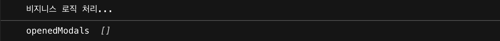

import { CodeWave } from 'gatsby-theme-waves';

지난 글에서는 일반적으로 모달을 관리할때 코드가 불필요하게 많아지는 문제점에 대해서 살펴봤습니다.
그리고 이 문제점을 해결하기 위해 해야할 사항들을 살펴봤습니다. 그중에서도 모달 관리를 위한 State를 외부로 뽑아내는 부분까지 살펴봤는데요.
이번 글에서는 모달을 렌더링 하는 부분에 대해서 살펴보도록 하겠습니다.

## 모달 렌더링 하기

지난 글에서 버튼을 통해 모달 컴포넌트와 컴포넌트에 넘겨줄 props를 ModalsState에 저장했습니다.


<CodeWave>

```jsx
import React from 'react';

const Modals = () => {
  return (
    <>
      {/* 모달 렌더링이 필요함 */}
    </>
  )
};

export default Modals;
```

이제 이 state 값을 이용해서 모달 컴포넌트를 렌더링 해보겠습니다.
Modals.js 파일을 만들어서 열리는 모달 컴포넌트를 이용합니다.


```jsx
import React, { useContext } from 'react';
import { ModalsStateContext } from './ModalsContext';

const Modals = () => {
  const openedModals = useContext(ModalsStateContext);

  return (
    <>
      {/* 모달 렌더링이 필요함 */}
    </>
  )
};

export default Modals;
```

ModalsStateContext에 접근해서 모달 정보를 가져옵니다.


```jsx
import React, { useContext } from 'react';
import { ModalsStateContext } from './ModalsContext';

const Modals = () => {
  const openedModals = useContext(ModalsStateContext);

  return openedModals.map((modal, index) => {
    const { Component, props } = modal;

    return <Component key={index} {...props} />;
  });
};

export default Modals;
```


openedModals가 리스트기 때문에 map을 이용해서 렌더링 합니다.
이 때 modal객체는 Component에 모달 컴포넌트와 props에 넘겨줄 props가 있습니다.
props는 스프레드 연산자를 이용해서 모두 넘겨줄 수 있도록 합니다.

</CodeWave>

<CodeWave>

```jsx
import ReactModal from "react-modal";

const MyModal = ({ isOpen }) => {
  return (
    <ReactModal isOpen>
      <div>모달 입니다.</div>
    </ReactModal>
  );
};

export default MyModal;
```

그리고 이전 글에서 MyModal을 구현할 때 isOpen을 넘겨주도록 했는데 이 부분은 의미가 없기 때문에 props를 제거해주고 ReactModal의 isOpen을 그대로 넘겨줍니다.

</CodeWave>

이제 모달 열기 버튼을 누르면 짠! 하고 모달이 열리게 됩니다.


## 확인, 취소 자동으로 닫히게 만들기

이제 다음 단계는 모달안의 확인, 취소 버튼을 누르면 모달이 닫히도록 해줘야 합니다.
각 모달마다 로직을 넣어도 되겠지만 우리는 좀더 효율적인 방버으로 처리하도록 하겠습니다.

<CodeWave>

```jsx
import ReactModal from "react-modal";

const MyModal = () => {
  const handleClickSubmit = () => {
  };

  const handleClickCancel = () => {
  };

  return (
    <ReactModal isOpen>
      <div>모달 입니다.</div>
      <div>
        <button onClick={handleClickSubmit}>확인</button>
        <button onClick={handleClickCancel}>취소</button>
      </div>
    </ReactModal>
  );
};

export default MyModal;
```

Modals 컴포넌트에서 처리할 수 있도록 하겠습니다. 우선은 MyModal에 확인, 취소 버튼을 추가해줍니다.


```jsx
import ReactModal from "react-modal";

const MyModal = ({ onSubmit, onClose }) => {
  const handleClickSubmit = () => {
    onSubmit();
  };

  const handleClickCancel = () => {
    onClose();
  };

  return (
    <ReactModal isOpen>
      <div>모달 입니다.</div>
      <div>
        <button onClick={handleClickSubmit}>확인</button>
        <button onClick={handleClickCancel}>취소</button>
      </div>
    </ReactModal>
  );
};

export default MyModal;
```

그리고 props로 onSubmit과 onClose를 받아서 호출하도록 처리해줍니다.
</CodeWave>


<CodeWave>

```jsx
import React, { useContext } from "react";
import { ModalsStateContext } from "./ModalsContext";

const Modals = () => {
  const openedModals = useContext(ModalsStateContext);

  return openedModals.map((modal, index) => {
    const { Component, props } = modal;

    return <Component key={index} {...props} />;
  });
};

export default Modals;
```


모달 컴포넌트에는 onSubmit과 onClose를 넘겨줘야 하는데 이 처리는 Modals에서 해줍니다.


```jsx
import React, { useContext } from "react";
import { 
  ModalsDispatchContext, 
  ModalsStateContext
} from "./ModalsContext";

const Modals = () => {
  const openedModals = useContext(ModalsStateContext);
  const { close } = useContext(ModalsDispatchContext);

  return openedModals.map((modal, index) => {
    const { Component, props } = modal;
    const onClose = () => {
      close(Component);
    };

    return (
      <Component 
        {...props}
        key={index}
        onClose={onClose} 
      />
    );
  });
};

export default Modals;
```

onClose는 모달을 닫아줘야 하기 때문에 ModalsDispatchContext에서 close 함수를 사용합니다.
close 함수에는 모달 컴포넌트를 넘겨서 닫아주도록 정의하고, onClose 함수를 모달의 props에 넘겨주면 되겠습니다.

```jsx
import React, { useContext } from "react";
import { 
  ModalsDispatchContext, 
  ModalsStateContext
} from "./ModalsContext";

const Modals = () => {
  const openedModals = useContext(ModalsStateContext);
  const { close } = useContext(ModalsDispatchContext);

  return openedModals.map((modal, index) => {
    const { Component, props } = modal;
    const onClose = () => {
      close(Component);
    };

    const handleSubmit = () => {
      // 비지니스 로직 처리
    };

    return (
      <Component 
        {...props}
        key={index}
        onClose={onClose} 
        onSubmit={handleSubmit}
      />
    );
  });
};

export default Modals;
```

onSubmit은 onClose 보다는 살짝 복잡합니다. 우선 onSubmit을 처리해줄 handleSubmit 함수를 만들어 줍니다.


```jsx
import React, { useContext } from "react";
import { 
  ModalsDispatchContext, 
  ModalsStateContext
} from "./ModalsContext";

const Modals = () => {
  const openedModals = useContext(ModalsStateContext);
  const { close } = useContext(ModalsDispatchContext);

  return openedModals.map((modal, index) => {
    const { Component, props } = modal;
    const onClose = () => {
      close(Component);
    };

    const handleSubmit = () => {
      // 비지니스 로직 처리
      onClose();
    };

    return (
      <Component 
        {...props}
        key={index}
        onClose={onClose} 
        onSubmit={handleSubmit}
      />
    );
  });
};

export default Modals;
```


handleSubmit에서 비지니스 로직이 돌아간 후 닫혀야 하기 때문에 위에 만들었던 onClose 를 그대로 호출해줍니다.


```jsx
import React, { useContext } from "react";
import { 
  ModalsDispatchContext, 
  ModalsStateContext
} from "./ModalsContext";

const Modals = () => {
  const openedModals = useContext(ModalsStateContext);
  const { close } = useContext(ModalsDispatchContext);

  return openedModals.map((modal, index) => {
    const { Component, props } = modal;
    const { onSubmit, ...restProps } = props;
    const onClose = () => {
      close(Component);
    };

    const handleSubmit = async () => {
      if (typeof onSubmit === 'function') {
        await onSubmit();
      }
      onClose();
    };

    return (
      <Component 
        {...restProps}
        key={index}
        onClose={onClose} 
        onSubmit={handleSubmit}
      />
    );
  });
};

export default Modals;
```

비니지스 로직같은 경우는 모달을 열어주는 쪽에서 모달의 props로 넘겨줄 수 있도록 처리할 예정입니다.
그렇기 때문에 ModalState에 저장된 props 안의 onSubmit을 호출하도록 처리해야 합니다.
모든 모달에서 onSubmit을 필요로 하지 않기 때문에 props에 onSubmit 을 넘겨준 경우에만 처리하도록 함수인지 확인을 해준 후 호출합니다.

props에서 onSubmit을 제외한 나머지를 restProps로 재정의 하고 Component에 스프레드로 넘겨주는 props를 restProps로 변경합니다.

그리고 onSubmit 동작이 비동기일지 동기일지 모르기 때문에 async/await를 사용해서 onSubmit 동작이 끝난후에 닫히도록 처리합니다.

</CodeWave>

<CodeWave>

```jsx
import useModals from "./useModals";
import MyModal from "./MyModal";

const App = () => {
  const { openModal } = useModals();

  const handleClick = () => {
    openModal(MyModal, {
      onSubmit: () => {
        console.log("비지니스 로직 처리...");
      }
    });
  };

  return (
    <div className="App">
      <button onClick={handleClick}>모달 열기</button>
    </div>
  );
};

export default App;
```

이제 확인, 취소에 대한 닫힘 처리 구현은 완료됐습니다. 잘 되는지 확인해 볼까요?
모달을 열어주는 부분에서 onSubmit 함수를 넘겨주도록 합니다.

</CodeWave>


이제 버튼을 눌러 모달을 열어준 후 취소를 누르면 모달이 닫히고 Context에 modal 리스트도 빈 리스트로 변하게 됩니다.


확인을 누른 경우는 onSubmit으로 넘겨준 함수가 실행되면서 콘솔에 메시지를 찍어주고 모달이 닫히게 됩니다.




자! 여기까지 외부 State를 이용해서 모달을 열고 닫을 수 있는 부분까지 구현을 했습니다.
하지만 마지막으로 조금 이상한 부분이 있습니다.


첫 번째 글에서 App 컴포넌트내에 Modal을 직접 import 하지 않고 사용할 수 있도록 하겠다고 했는데 지금은 useModal에 MyModal을 직접 import 해서 사용하고 있죠.
이제 마지막으로 이 부분을 개선하는것을 살펴보도록 하겠습니다.

## 모달 컴포넌트 중앙에서 관리하기

<CodeWave>

```jsx
import React, { useContext } from "react";
import { 
  ModalsDispatchContext, 
  ModalsStateContext
} from "./ModalsContext";

const Modals = () => {
  const openedModals = useContext(ModalsStateContext);
  const { close } = useContext(ModalsDispatchContext);

  return openedModals.map((modal, index) => {
    const { Component, props } = modal;
    const { onSubmit, ...restProps } = props;
    const onClose = () => {
      close(Component);
    };

    const handleSubmit = () => {
      if (typeof onSubmit === "function") {
        onSubmit();
      }
      onClose();
    };

    return (
      <Component
        {...restProps}
        key={index}
        onClose={onClose}
        onSubmit={handleSubmit}
      />
    );
  });
};

export default Modals;
```

App 컴포넌트에서 사용하는 MyModal을 어딘가에서 한번에 관리해주도록 처리할 예정입니다.
바로 Modals 컴포넌트죠. Modals 컴포넌트의 이름에 맞에 여러 모달을 여기서 관리해주면 될것 같습니다.


```jsx
import React, { useContext } from "react";
import { 
  ModalsDispatchContext, 
  ModalsStateContext
} from "./ModalsContext";
import MyModal from './MyModal';

export const modals = {
  myModal: MyModal
};

const Modals = () => {
  // 생략...
};

export default Modals;
```

컴포넌트 함수 바깥 부분에 modals를 하나 정의해서 export 해주도록 합니다.

그리고 이 modals에는 구현하는 서비스에서 사용하는 모달 컴포넌트를 이름에 매핑시켜주기만 하면 됩니다.

</CodeWave>

<CodeWave>

```jsx
import useModals from "./useModals";
import MyModal from "./MyModal";

const App = () => {
  const { openModal } = useModals();

  const handleClick = () => {
    openModal(MyModal, {
      onSubmit: () => {
        console.log("비지니스 로직 처리...");
      }
    });
  };

  return (
    <div className="App">
      <button onClick={handleClick}>모달 열기</button>
    </div>
  );
};

export default App;
```

그러면 App 컴포넌트에서는 이를 이용할 수 있게 되는데요.


```jsx
import useModals from "./useModals";
import { modals } from "./Modals";

const App = () => {
  const { openModal } = useModals();

  const handleClick = () => {
    openModal(modals.myModal, {
      onSubmit: () => {
        console.log("비지니스 로직 처리...");
      }
    });
  };

  return (
    <div className="App">
      <button onClick={handleClick}>모달 열기</button>
    </div>
  );
};

export default App;
```

이제 모달을 직접 import 하지 않고 modals를 import해서 모달의 이름에 매핑된 컴포넌트를 넘겨주기만 하면 됩니다.

이런 식으로 서비스 내에 사용되는 모든 모달을 Modals 컴포넌트에서 정의해 두면 매번 사용하는 컴포넌트에서 import 해서 사용하지 않고 이름만으로도 바로 사용할 수 있게 되겠습니다.
</CodeWave>

<CodeWave>

```jsx
import React, { useContext } from "react";
import { 
  ModalsDispatchContext, 
  ModalsStateContext
} from "./ModalsContext";
import MyModal1 from './MyModal1';
import MyModal2 from './MyModal2';
import MyModal3 from './MyModal3';
import MyModal4 from './MyModal4';
import MyModal5 from './MyModal5';
...

export const modals = {
  myModal1: MyModal1,
  myModal2: MyModal2,
  myModal3: MyModal3,
  myModal4: MyModal4,
  myModal5: MyModal5,
  ...
};

const Modals = () => {
  // 생략...
};

export default Modals;
```

자 그럼 Modals에 추가해야 할 Modal이 많아지면 어떤 문제가 발생할까요?
이런 경우 아직 사용하지 않는 모달 컴포넌트가 모두 한번에 import 되기 때문에 초기 로딩 속도가 느려지는 현상을 겪게 됩니다.


```jsx
import loadable from '@loadable/component';
import React, { useContext } from "react";
import { 
  ModalsDispatchContext, 
  ModalsStateContext
} from "./ModalsContext";

export const modals = {
  myModal1: loadable(() => import('./MyModal1')),
  myModal2: loadable(() => import('./MyModal2')),
  myModal3: loadable(() => import('./MyModal3')),
  myModal4: loadable(() => import('./MyModal4')),
  myModal5: loadable(() => import('./MyModal5')),
  ...
};

const Modals = () => {
  // 생략...
};

export default Modals;
```


필요한 컴포넌트만 그때 그때 로딩할 수 있도록 다이나믹 import 기법을 사용해서 처리해주면 초기 로딩 속도가 느려지는 현상을 깔끔하게 처리할 수 있습니다.
여기서는 @loadable/component 라이브러리를 사용해서 처리하겠습니다.
</CodeWave>


자 이렇게 해서 마무리가 됐습니다. 일반적인 모달 관리 방법에서 겪는 코드량 증가에 대한 문제와 파편화된 모달 관리를 해결하기 위한 방법을 살펴봤습니다.

생각보다 구현해야 하는 내용이 많아 굉장히 복잡한것처럼 느껴지지만 한번 이렇게 구현해 놓고 사용하게 되면 서비스가 커지면서 겪을 수 있는 모달 관리의 문제를 겪지 않을 수 있습니다.

다시 한번 정리하자면,

- 파편화된 모달 컴포넌트를 Modals에 모아서 관리합니다.
- 모달을 열기위한 컴포넌트 내부의 state 관리를 외부에서 관리합니다.
- 모달을 닫아주기 위한 부분도 컴포넌트 내부에서 Modals 로 옮겨 개발자가 신경쓰지 않아도 닫히도록 처리합니다.

긴글 읽어주셔서 감사합니다. 부디 모달 관리의 불편함을 겪는 분들께 도움이 됐으면 좋겠습니다.