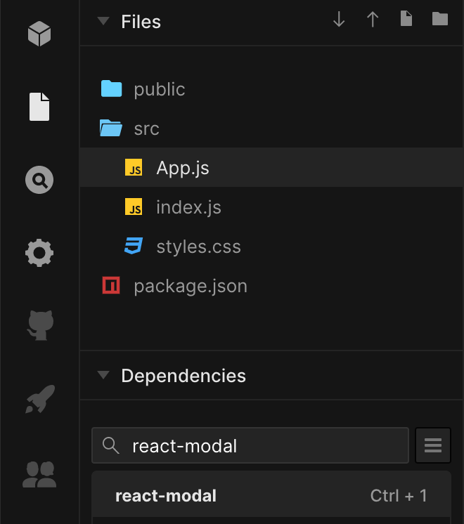

import { CodeWave } from 'gatsby-theme-waves';

리액트는 컴포넌트 기반의 UI 라이브러리 입니다. 이러한 특성 덕분에 화면에 보여주고 싶은 UI는 컴포넌트를 만들어서 조합해 사용합니다.
리액트에서의 모달도 이와 다르지 않은데요. 모달을 렌더링 하기 위해서 모달 컴포넌트를 만들어서 렌더링 해줘야 합니다.
이 때 발생하는 몇 가지 불편한 점과 어떻게 개선하면 좋을지 살펴보도록 하겠습니다.

## 준비하기

리액트에서 모달을 직접 구현하기 귀찮으니 구글에서 react modal을 검색해 봅니다.
현재 날짜 기준으로는 [react-modal](https://github.com/reactjs/react-modal) 이라는 라이브러리가 바로 보이는데 이걸 이용해보겠습니다.

저는 귀찮아서 [CodeSandbox](https://codesandbox.io/) 라는 멋진 서비스를 사용하도록 하겠습니다.
여기서는 CodeSandbox에 대해서는 자세히 설명하지 않겠습니다. 그냥 온라인상에서 빠르게 코딩을 할 수 있는 서비스라고 생각하면 이해가 쉬울것 같습니다.

CodeSandbox로 React 템플릿을 이용해서 만든 후에 좌측을 보면 dependency를 추가할 수 있습니다.
여기에 react-modal을 검색해서 추가해주도록 합니다.


이렇게 하면 빠르게 테스트 해볼 수 있는 환경이 생겼습니다.

## 모달 이용해 보기

이제 모달을 이용해 보도록 하겠습니다.

<CodeWave>

```jsx
import { StrictMode } from 'react';
import ReactDOM from 'react-dom';

import App from './App';

const rootElement = document.getElementById('root');
ReactDOM.render(
  <StrictMode>
    <App />
  </StrictMode>,
  rootElement,
);
```

GitHub에 README를 읽어보면 처음에 모달을 렌더링할때 기준이 되는 엘리먼트를 지정해줘야 한다고 합니다.

리액트를 처음 렌더링 해주는 엘리먼트를 똑같이 지정하면 될것 같습니다.

```jsx
import { StrictMode } from 'react';
import ReactDOM from 'react-dom';
import ReactModal from 'react-modal';

import App from './App';

ReactModal.setAppElement('#root');

const rootElement = document.getElementById('root');
ReactDOM.render(
  <StrictMode>
    <App />
  </StrictMode>,
  rootElement,
);
```

ReactModal의 setAppElement로 `#root`를 지정해줍니다.

```jsx
import ReactModal from 'react-modal';

const MyModal = (closeModal) => {
  const handleClickClose = () => {
    closeModal();
  };

  return (
    <ReactModal isOpen>
      <div>모달 입니다.</div>
      <button onClick={handleClickClose}>모달 닫기</button>
    </ReactModal>
  );
};

export default MyModal;
```

자 우선 react-modal을 이용해서 먼저 모달 컴포넌트를 만들어 보도록 하겠습니다.

```jsx
const App = () => {
  const handleClick = () => {};

  return (
    <div className="App">
      <button onClick={handleClick}>모달 열기</button>
    </div>
  );
};
```

버튼을 클릭해서 모달을 보여줘야 하기 때문에

</CodeWave>
