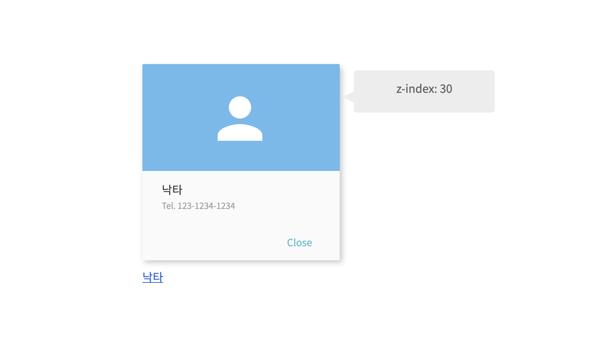
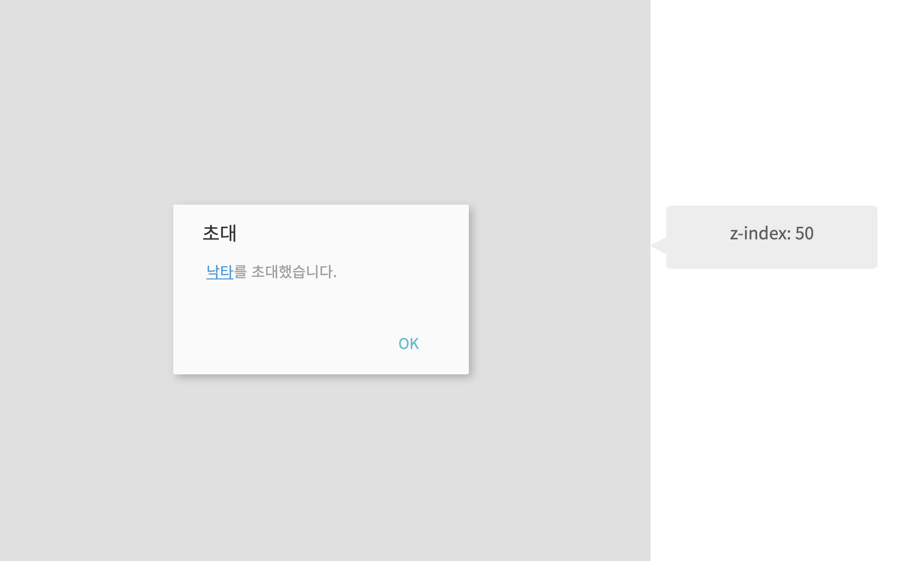
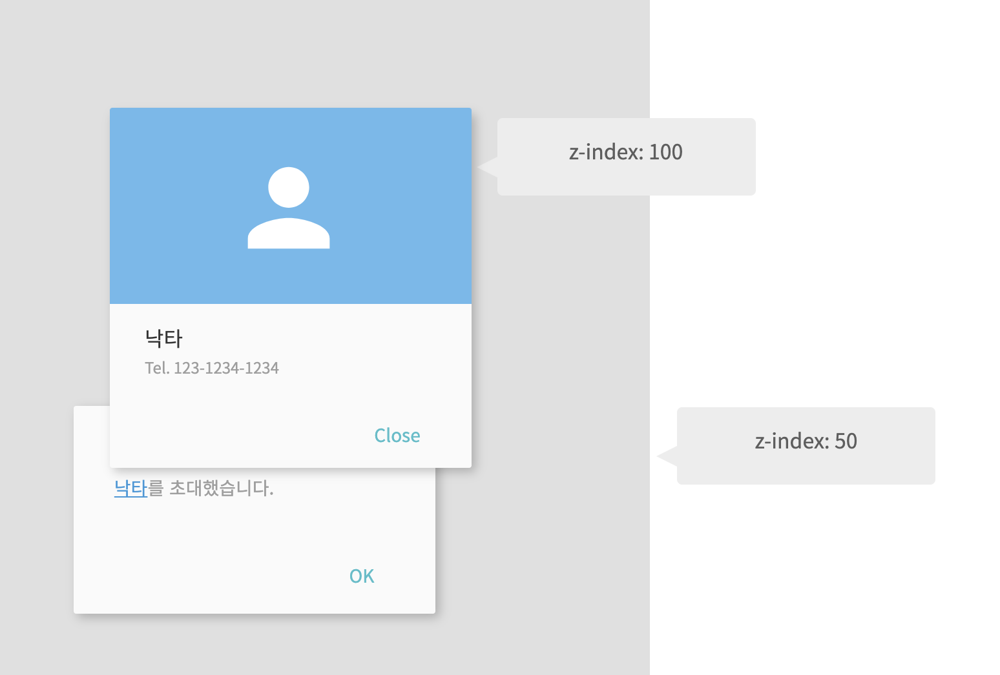
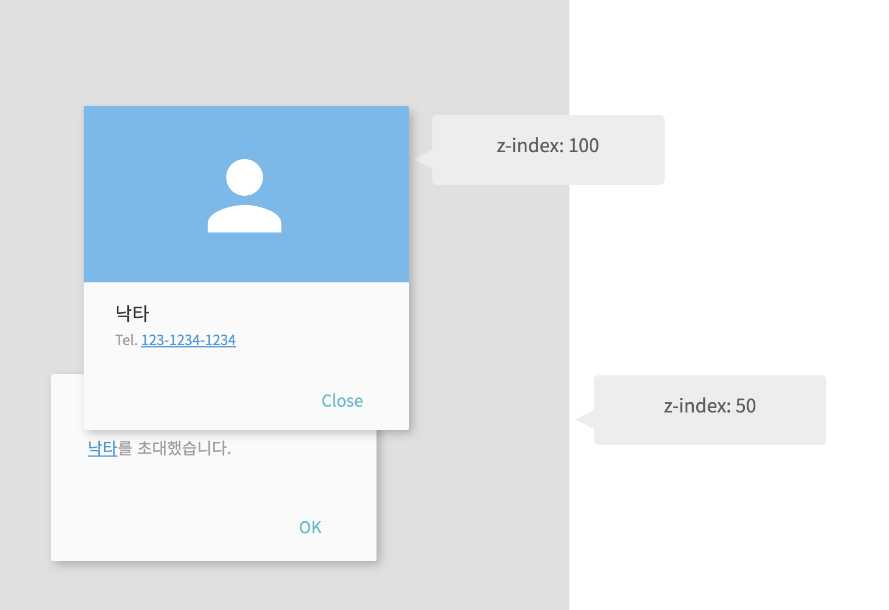
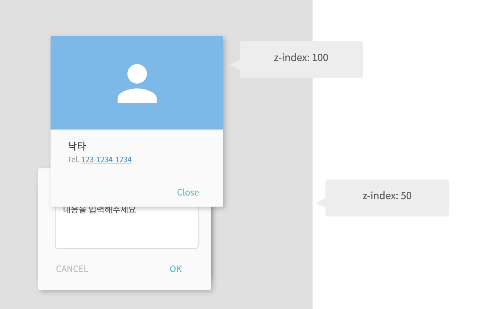

import { CodeWave } from 'gatsby-theme-waves';

웹 프론트엔드 개발자라면 Dropdown, Modal과 같은 z-index 값을 이용해야 하는 엘리먼트를 개발해야 하는 경우가 생기기 마련입니다.
z-index는 엘리먼트의 position 속성이 static이 아닌 경우 효과가 나타나게 됩니다. 이 z-index 값의 숫자가 높을수록 더 위쪽에 보이게 됩니다.

그러다 보니 자칫 잘못하면 의도치 않게 다른 엘리먼트에 가려지게 되는 경우가 생깁니다. 
이번 글에서는 React를 이용해서 개발 할 때 이런 상황을 조금이나마 피할 수 있도록 z-index를 관리해 주는 방법에 대해서 살펴보도록 하겠습니다.

## 보통의 z-index 관리

z-index의 값은 css의 속성이기 때문에 보통 고정 값으로 적용을 하게 됩니다. 예를 들어, 사용자의 이름을 누르면 해당 사용자의 프로필을 보여주는 레이어가 뜬다고 가정해 보겠습니다. 이때 프로필 레이어의 z-index는 30입니다.



그리고 어떤 모달하나를 가정해보겠습니다. 이 모달에는 사용자의 이름이 표시가 됩니다. 이 모달은 z-index 값이 50입니다. 그리고 이 이름을 누르면 위에 나왔던 사용자의 프로필을 보여주는 레이어가 뜨게 됩니다.



자 그럼, 이 상태에서 사용자의 이름을 누르면 어떻게 될까요? 당연히 아무것도 표시되지 않습니다. 모달의 z-index 값이 30 보다 큰 50이기 때문이죠. 그럼 개발자는 프로필 레이어의 z-index 값을 50보다 큰 값으로 수정해줘야 합니다. 넉넉하게 100정도로 올리면 될것 같습니다.



됐습니다. 이제 모달안에서도 사용자 이름을 눌러서 프로필을 확인할 수 있게 됐습니다.

자 그런데 서비스에 새 기능을 넣게 됐습니다. 사용자의 전화번호를 눌러서 문자를 보낼 수 있는 기능을 추가했습니다.



번호를 누르면 문자를 보낼 수 있는 모달을 하나 띄워주도록 한다고 가정합시다. 어떻게 될까요? 모달은 z-index 값을 공통으로 50을 사용한다고 한다면 아래와 같이 보이게 됩니다.



모달 안에서 프로필 레이어가 떠야 하기 때문에 50보다 큰 숫자인 100을 설정했기 때문입니다. 그렇다고 문자 보내기 기능 때문에 프로필 레이어의 z-index 값을 다시 50보다 작게 낮추면 다시 프로필 레이어가 초대 모달에서는 더 밑으로 내려가게 되겠죠.

다른 해결 방법은 모달마다 z-index 값을 따로 설정하면 되는데, 이런 모달들이 하나 둘씩 늘어나다보면 왜 특정 모달의 z-index값이 이런 값으로 설정됐는지 히스토리를 알지 못하면 이해하기 어렵게 됩니다.

이런 상황을 어떻게 하면 해결할 수 있을까요?

<br/>
<br/>
<br/>

## z-index를 관리하는 ZIndexer

방금과 같은 상황에서 처음 초대 모달은 z-index가 30 입니다.
그리고 프로필 레이어를 띄우게 될 경우 30보다 큰 숫자가 z-index 값으로 쓰이면 정상적으로 보이게 될것 같습니다. 
마지막으로 문자 보내기 모달의 z-index 값은 프로필 레이어의 z-index 값보다 더 큰 숫자면 될것 같습니다.

이런식으로 마지막 z-index 값에서 필요할때 마다 z-index 값을 올려서 사용하면 어떨까요?
그러면 위에서 했던 것처럼 z-index 값을 이리 저리 수정하면서 관리하지 않아도 될것 같습니다.

<CodeWave>

```jsx
function ZIndexer({ children }) {
  
}

export default ZIndexer;
```


자 그럼 이런 역할을 해줄 수 있는 `ZIndexr`라는 컴포넌트를 하나 만들어 보겠습니다.

  

```jsx
const defaultZIndex = 30;

function ZIndexer({ children }) {
  
  return children({ zIndex: defaultZIndex });
}

export default ZIndexer;
```

ZIndex 컴포넌트는 적당한 z-index 값을 넘겨주는 역할을 해야하기 때문에 children에 z-index 값을 넘겨줄 수 있어야 합니다.
그러려면 [Render Prop](/react-hoc-render-prop)을 이용해야 하기 때문에 children은 함수형태가 돼야 합니다.


```jsx
const defaultZIndex = 30;

function ZIndexer({ children }) {
  
  return children({ zIndex: defaultZIndex });
}

export default ZIndexer;


function Modal() {
  
  return (
    <ZIndexer>
      {({ zIndex }) => (
        <div style={{ zIndex }}>모달 내용</div>
      )}
    </ZIndexer>
  )
}

export default Modal;
```

이제 올바른 z-index 값이 필요한 컴포넌트에서는 `ZIndexer` 컴포넌트에서 넘겨주는 z-index 값을 이용할 수 있게 됩니다.

children은 zIndex 값을 받을 수 있기 때문에 파라미터로 받은 zIndex 값을 이용해서 스타일을 적용해 주면 됩니다.


```jsx 1,5
const defaultZIndex = 30;

function ZIndexer({ children }) {
  
  return children({ zIndex: defaultZIndex });
}

export default ZIndexer;


function Modal() {
  
  return (
    <ZIndexer>
      {({ zIndex }) => (
        <div style={{ zIndex }}>모달 내용</div>
      )}
    </ZIndexer>
  )
}

export default Modal;
```

그런데 우리가 만든 ZIndexer 컴포넌트는 무조건 30이라는 값만 남겨주기 때문에 마지막 열었던 z-index 값을 기억하고 여기에 1을 더해서 넘겨주도록 수정해보겠습니다.

</CodeWave>

<br/>
<br/>


## z-index값 저장소 ZIndexContext

서비스 전체에서 사용된 z-index 값을 알아야 하기 때문에 z-index가 사용될때마다 어딘가에 저장해줘야 합니다. 이걸 위해서 React Context를 이용하도록 하겠습니다.

Redux나 Mobx와 같은 다른 State Management 도구를 사용해서 관리해도 될것 같습니다.


<CodeWave>

```jsx
export const ZIndexContext = createContext({
  zIndexes: [],
  addZIndex: (_: number) => {},
  removeZIndex: (_: number) => {}
});
```

Context에는 사용된 z-index 값을 저장할 `zIndexes`와 z-index 값을 추가/삭제 할 수 있는 `addZIndex`, `removeZIndex` 함수가 필요합니다.


```jsx
export const ZIndexContext = createContext({
  zIndexes: [],
  addZIndex: (_: number) => {},
  removeZIndex: (_: number) => {}
});

export function ZIndexProvider({children}) {
  const value = { 
    zIndexes: [],
    addZIndex: (_: number) => {},
    removeZIndex: (_: number) => {}
  };

  return (
    <ZIndexContext.Provider value={value}>
      {children}
    </ZIndexContext.Provider>
  )
}
```

이제 Context의 값을 제공해줄 ZIndexProvider를 만들어 보겠습니다.


```jsx
export const ZIndexContext = createContext({
  zIndexes: [],
  addZIndex: (_: number) => {},
  removeZIndex: (_: number) => {}
});

export function ZIndexProvider({children}) {
  const [zIndexes, setZIndexes] = useState([]);
  
  const value = { 
    zIndexes, 
    addZIndex: (_: number) => {},
    removeZIndex: (_: number) => {}
  };

  return (
    <ZIndexContext.Provider value={value}>
      {children}
    </ZIndexContext.Provider>
  )
}
```


ZIndexContext에 필요한 값인 zIndexes는 useState를 이용하도록 수정합니다.


```jsx
export const ZIndexContext = createContext({
  zIndexes: [],
  addZIndex: (_: number) => {},
  removeZIndex: (_: number) => {}
});

export function ZIndexProvider({children}) {
  const [zIndexes, setZIndexes] = useState([]);
  
  const addZIndex = (zIndex) => {
    setZIndexes(zIndexes => [...zIndexes, zIndex]);
  };
  
  const removeZIndex = (zIndex) => {
    setZIndexes(indexes => {
      const index = indexes.findIndex(
        index => index === zIndex
      );
      return indexes.filter((_, i) => i !== index);
    });
  }
  
  const value = { zIndexes, addZindex, removeZIndex };

  return (
    <ZIndexContext.Provider value={value}>
      {children}
    </ZIndexContext.Provider>
  )
}
```


그리고 `addZIndex`와 `removeZIndex`는 `setZIndexes`를 이용해서 마저 구현하도록 합니다.


```jsx
export const ZIndexContext = createContext({
  zIndexes: [],
  addZIndex: (_: number) => {},
  removeZIndex: (_: number) => {}
});

export function ZIndexProvider({children}) {
  const [zIndexes, setZIndexes] = useState([]);
  
  const addZIndex = (zIndex) => {
    setZIndexes(zIndexes => [...zIndexes, zIndex]);
  };
  
  const removeZIndex = (zIndex) => {
    setZIndexes(indexes => {
      const index = indexes.findIndex(
        index => index === zIndex
      );
      return indexes.filter((_, i) => i !== index);
    });
  }
  
  const value = { zIndexes, addZindex, removeZIndex };

  return (
    <ZIndexContext.Provider value={value}>
      {children}
    </ZIndexContext.Provider>
  )
}

function App() {
  return (
    <ZIndexProvider>
      ...
    </ZIndexProvider>
  )
}
```

이제 우리가 만든 애플리케이션 어디에서건 ZIdexContext를 사용할 수 있도록 서비스의 루트 컴포넌트에서 ZIndexProvider를 렌더링 해줍니다.

</CodeWave>

<br/>
<br/>

## ZIndexContext를 이용하는 ZIndexer

<CodeWave>

```jsx
const defaultZIndex = 30;

function ZIndexer({ children }) {
  
  return children({ zIndex: defaultZIndex });
}

export default ZIndexer;
```

`ZIndexer` 컴포넌트를 다시 살펴볼까요? 지금은 항상 30이라는 값만 넘겨주고 있습니다.
이젠 ZIndexContext를 이용해서 항상 최신 값보다 높은 값을 넘겨줄 수 있도록 로직을 넣어보겠습니다.


```jsx
const defaultZIndex = 30;

function ZIndexer({ children }) {
  const { 
    zIndexes, 
    addZIndex, 
    removeZIndex 
  } = useContext(ZIndexContext);
  
  return children({ zIndex: defaultZIndex });
}

export default ZIndexer;
```

### ZIndexContext 이용하기

`useContext` 훅을 이용해서 ZIndexContext에 저장된 값을 사용합니다.


```jsx
const defaultZIndex = 30;

function ZIndexer({children}) {
  const { 
    zIndexes, 
    addZIndex, 
    removeZIndex 
  } = useContext(ZIndexContext);
  
  const hasLastIndex = zIndexes.length > 0;
  const nextZIndex = hasLastIndex 
    ? zIndexes[zIndexes.length - 1] + 1 
    : defaultZIndex;
  
  return children({ zIndex: nextZIndex });
}

export default ZIndexer;
```


zIndexes가 비어있는 경우는 처음으로 z-index 값이 필요한 경우이기 때문에 defaultIndex를 이용합니다.
그렇지 않은 경우는 마지막 z-index 값에서 1을 더한 값을 넘겨주면 됩니다.


```jsx
const defaultZIndex = 30;

function ZIndexer({children}) {
  const { 
    zIndexes, 
    addZIndex, 
    removeZIndex 
  } = useContext(ZIndexContext);
  const [zIndex, setZIndex] = useState(-1);

  useEffect(() => {
    const hasLastIndex = zIndexes.length > 0;
    const nextZIndex = hasLastIndex 
      ? zIndexes[zIndexes.length - 1] + 1 
      : defaultZIndex;
    
    setZIndex(nextZIndex);
    addZIndex(nextZIndex);
    
    return () => {
      removeZIndex(nextZIndex);
    }
  }, []);
  
  return children({ zIndex });
}

export default ZIndexer;
```

그런데 이렇게 하면 ZIndexContext에 사용한 zIndex 값이 저장되지 않기 때문에, ZIndexer에서 사용한 z-index 값을 ZIndexContext에 저장해주도록 합니다. 
현재 ZIndexer에서 사용할 zIndex 값을 저장하기 위해 useState 훅을 사용합니다. 그리고 useEffect 훅으로 처음 렌더링됐을때 한번만 zIndex 값을 계산하도록 해줍니다.


```jsx
function Modal() {
  return (
    <ZIndexer>
      {({zIndex}) => (
        <div style={{zIndex}}>모달 내용</div>
      )}
    </ZIndexer>
  )
}

function Profile({user}) {
  return (
    <ZIndexer>
      {({zIndex}) => (
        <div style={{zIndex}}>
          <div></div>
          <div>{user.name}</div>
          <div>Tel. {user.tel}</div>
        </div>
      )}
    </ZIndexer>
  )
}
```


자, 이렇게 ZIndexer 컴포넌트가 완성됐습니다. 
이제 `ZIndexer` 컴포넌트를 사용해 볼까요? z-index가 필요한 곳에 ZIndexer 컴포넌트를 이용하면 됩니다.

이렇게 z-index가 필요한 컴포넌트에 ZIndexer 컴포넌트로 한번 감싸서 항상 최신의 z-index 값을 받아서 사용하기만 하면 됩니다.

</CodeWave>
